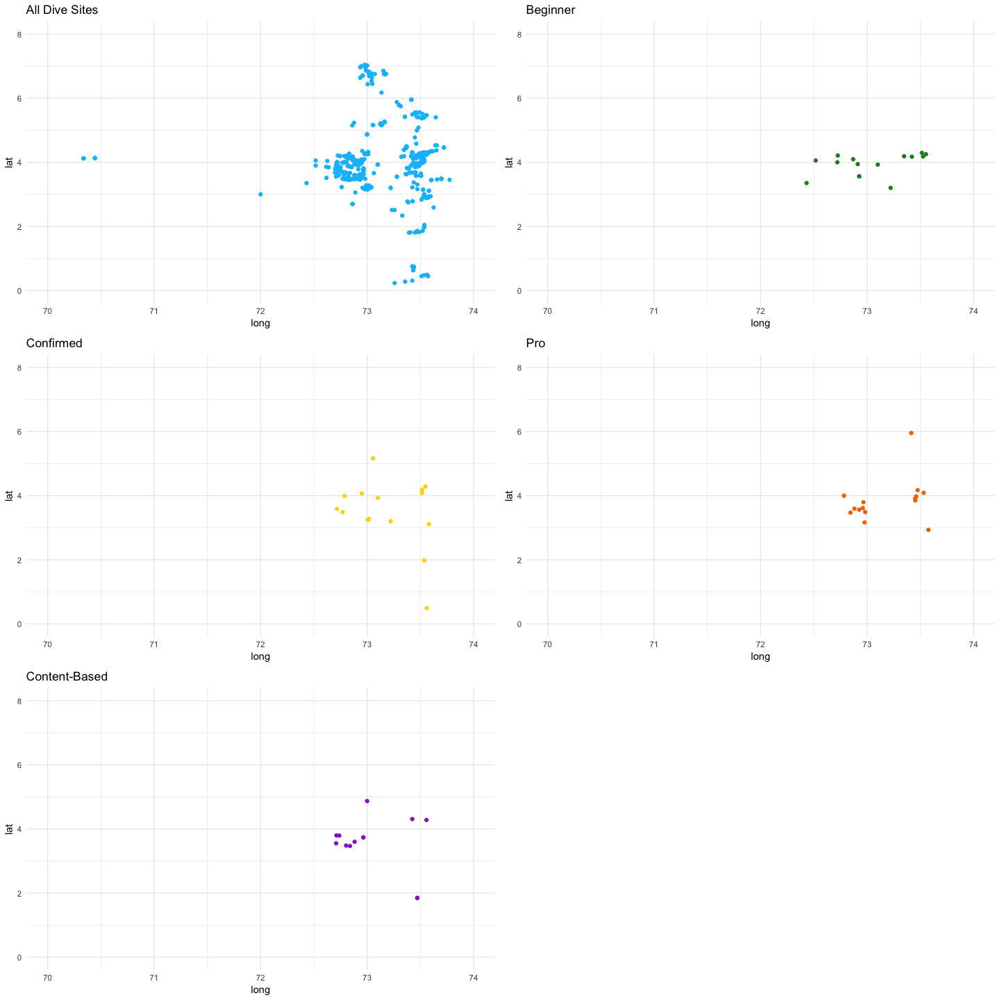

***

# Are you a scuba diver ?  

**No ??**  
Then, I *highly* recommend you becoming one ! [Check out why](https://www.youtube.com/watch?v=zLOBri_dOAA&list=PLKHEmnEVpJa8wDzHu4IxOYaWkL6WVXimP&index=12).

**Yes ?**  
Then you know how difficult it can be to organize your next dive trip. There are so many criteria to consider to pick your next destination !  

- The Type of Trip  
*Are you a full-time diver ready for a liveaboard experience ? Or would you prefer to take breaks and visit the surroundings ?*  

- The Budget  
*The cost of a dive trip can vary a lot depending on the destination: travel, accomodation, equipment rental, dive instructor, guide... Diving in the Maldives won't impact your wallet the same way than diving in the UK !*

- Your Level  
*Are you a certified diver ? Are the local dive sites adapted to your level ? Are you ready to challenge yourself, or would you rather take it easy ? Strong currents, cold waters, low visibility... There are many parameters to consider to avoid surprises..!*  

- The Dive Sites  
*Would you like to see corals ? Would you prefer experiencing The Blue ? Would you like to explore a wreck ? Each dive site offers a different experience, so pick wisely !*  

- The Fauna  
*Are you interested in big animals, like whale sharks, manta rays and mola molas ? Or maybe you prefer tiny things like pygmy seahorse, pipefishes and mandarin fish ? You might have to plan your trip on the right period to maximize your chances to watch one of these...*  

- The Dive Shop  
*Are the local dive shops well equiped ? Do they offer the certification and specialities you're dreaming of ? Is your favorite instructor still working there ? Trustable dive buddies are essential for an enjoyable experience !*  

</br>

**Dive Spotter** is the recommendation engine which will help you to pick the dive trip of your dreams !  

</br>

***

# Concept

Divers have a strong community. The certification agencies, like [PADI](http://www.padi.com) and [SSI](http://www.divessi.com), encourage this sense of belonging through their training programmes and dive centers partnerships. **Dive Spotter** leverages this community to generate its advices and convey them to its users as if they were talking to their dive buddy.  

Moreover, **every diver is required to keep a logbook**, which records the details of all their dives. Maximum depth, duration, dive site, weather conditions, technical settings, but also dive shop, instructor, dive buddy, encountered critters... These logbooks are requested at registration by dive centers, along with certification cards.  

If a diver's first logbook is usually hold in the form of a paper booklet, many divers quickly switch to a digital format, easier to travel with and allowing to attach the best snapshots of the day. Numerous solutions exist, but one online scuba logbook is particularly interesting: [DiveBoard](http://www.diveboard.com). This open-source platform is the **largest online logbook on the market since 2011**, gathering a huge dataset about scuba divers around the world: dive historics, dive site descriptions, dive centers reviews, critter pictures...  

**Dive Spotter** is taking advantage of this data mine to provide divers with travel advices, recommend trustable dive shops, and make dive trips planning a walk in the park !  

</br>

All the files of this project are saved in a [GitHub repository](https://github.com/ashomah/Dive-Spotter).

The libraries used for this project include: `recommenderlab` for recommendation algorithms, `ISOcodes` to use standard country codes, `dplyr` for data manipulation, `ggplot2`, `ggthemes` and `gridExtra` for plotting, and `kableExtra` to display tables in HTML.

</br>

***

# Demo Dataset  

#### 1. Source and Structure  

[DiveBoard](http://www.diveboard.com) is an open-source project, which can be reviewed on its [GitHub account](https://github.com/Diveboard). The structure of the database is provided, as well as table contents ([seed](https://github.com/Diveboard/diveboard-web/blob/master/db/seed.sql) and [seed data](https://github.com/Diveboard/diveboard-web/tree/master/db/seed_data/diveboard)). Unfortunately, for understandable privacy reasons, the user data is only accessible through API queries.  

As a consequence, the dataset used for this *Minimum Viable Product* (MVP) is only inspired from the information available in the DiveBoard database and its structure. It is built as the subset resulting from an *Extract Transform Load* (ETL) process using data related to dive records collected in the *Maldives* (dive spots, dive centers, users, critters...).  

The dataset consists in three (3) tables:  

- **Divers Table**  
Contains information on the divers, including their age, their certification level, the number of dives in their logbook, their cumulative depth, their cumulative bottom time, their longest dive, their deepest dive, their country of residence, as well as the list of dive types and critters they'd like to come across for their next dives.  

- **Sites Table**  
Contains information on the dive sites, including their country, their region, their location name, their location coordinates, their name, their max and average depths, their average visibility, their average current, their average temperature on surface, their average temperature on bottom, their type, and the list of critters which can usually be spotted there.  

- **User Logbook Ratings**  
Contains the rating from 1 to 5 for each dive sites the users already explored.  

The dataset doesn't contain any information about the dive shops, as this MVP will focus only on recommending dive sites. Further development will be necessary to provide additional recommendations to the users.  

After importing the `seed.sql` file into MySQL, it is possible to get a list of dive sites in the Maldives.  

```sql
SELECT	DiveBoard.spots.id,
        DiveBoard.spots.name,
        DiveBoard.spots.lat,
        DiveBoard.spots.long,
        DiveBoard.locations.name AS location_name,
        DiveBoard.regions.name AS region_name,
        DiveBoard.countries.cname AS country_name
FROM DiveBoard.spots
INNER JOIN DiveBoard.countries ON DiveBoard.spots.country_id = DiveBoard.countries.id
INNER JOIN DiveBoard.regions ON DiveBoard.spots.region_id = DiveBoard.regions.id
INNER JOIN DiveBoard.locations ON DiveBoard.spots.location_id = DiveBoard.locations.id
WHERE DiveBoard.countries.cname = 'Maldives'
AND UPPER(DiveBoard.locations.name) REGEXP 'ATOLL'
;
```

It is also possible to get a list of critters which have been spotted in the area.  

```sql
SELECT 	gbif.g_scientificnName,
        gbif.g_kingdom,
        gbif.g_phylum,
        gbif.g_class,
        gbif.g_order,
        gbif.g_family,
        gbif.g_genus,
        gbif.g_higherGeographyID,
        gbif.g_country,
        gbif.g_locality,
        gbif.g_habitat,
        COUNT(*) AS times_spotted
FROM DiveBoard.gbif_ipts AS gbif
WHERE gbif.g_country = 'Maldives'
AND UPPER(gbif.g_locality) REGEXP 'ATOLL'
GROUP BY gbif.g_scientificnName,
         gbif.g_kingdom,
         gbif.g_phylum,
         gbif.g_class,
         gbif.g_order,
         gbif.g_family,
         gbif.g_genus,
         gbif.g_higherGeographyID,
         gbif.g_country,
         gbif.g_locality,
         gbif.g_habitat
ORDER BY gbif.g_scientificnName ASC
;
```

Unfortunately, the common names list in English is incomplete, so only the scientific names are available. In order to simplify the understanding of this MVP, an arbitrary list of critters will be used, and the number of times they have been spotted on each site will be randomly generated.  

Some parameters are set to generate the dataset tables.

```r
set.seed(100)     #Seed
nDivers <- 1000   #Number of divers
target_user <- 2

#Arbitrary list of countries
sel_countries <- ISO_3166_1[ISO_3166_1$Name %in% c('France', 'United States', 'United Kingdom',
                                                   'Spain', 'Italy', 'Belgium', 'Norway', 'China',
                                                   'Maldives', 'Germany'),'Alpha_3']

#Arbitrary list of dive types
dive_types <- c('Sand', 'Coral Garden', 'Wall', 'Wreck', 'Pinnacles', 'Canyon')

#Arbitrary list of critters
critters_list <- c('Manta Ray', 'Jellyfish', 'Octopus', 'Whale Shark', 'Reef Shark',
                   'Mandarin Fish', 'Mola Mola')
```

</br>

#### 2. Dive Sites Table  

The dive sites are loaded from the CSV file exported from the DiveBoard database.


```r
kable(head(sites, 10), caption = 'Dive Sites from DiveBoard') %>%
  kable_styling(bootstrap_options = "striped")
```

<table class="table table-striped" style="margin-left: auto; margin-right: auto;">
<caption>Dive Sites from DiveBoard</caption>
 <thead>
  <tr>
   <th style="text-align:right;"> id </th>
   <th style="text-align:left;"> name </th>
   <th style="text-align:right;"> lat </th>
   <th style="text-align:right;"> long </th>
   <th style="text-align:left;"> location_name </th>
   <th style="text-align:left;"> region_name </th>
   <th style="text-align:left;"> country_name </th>
  </tr>
 </thead>
<tbody>
  <tr>
   <td style="text-align:right;"> 1517 </td>
   <td style="text-align:left;"> Banana Reef </td>
   <td style="text-align:right;"> 4.24139 </td>
   <td style="text-align:right;"> 73.5346 </td>
   <td style="text-align:left;"> Male Atoll </td>
   <td style="text-align:left;"> Laccadive Sea </td>
   <td style="text-align:left;"> Maldives </td>
  </tr>
  <tr>
   <td style="text-align:right;"> 1520 </td>
   <td style="text-align:left;"> Fish Head Mushi Mas Mingili Thila </td>
   <td style="text-align:right;"> 3.94229 </td>
   <td style="text-align:right;"> 72.9122 </td>
   <td style="text-align:left;"> Ari Atoll </td>
   <td style="text-align:left;"> Laccadive Sea </td>
   <td style="text-align:left;"> Maldives </td>
  </tr>
  <tr>
   <td style="text-align:right;"> 1523 </td>
   <td style="text-align:left;"> Guraidhoo Kandu </td>
   <td style="text-align:right;"> 4.21300 </td>
   <td style="text-align:right;"> 72.7248 </td>
   <td style="text-align:left;"> Male Atoll </td>
   <td style="text-align:left;"> Laccadive Sea </td>
   <td style="text-align:left;"> Maldives </td>
  </tr>
  <tr>
   <td style="text-align:right;"> 1524 </td>
   <td style="text-align:left;"> Hp Reef </td>
   <td style="text-align:right;"> 4.18850 </td>
   <td style="text-align:right;"> 73.3469 </td>
   <td style="text-align:left;"> Male Atoll </td>
   <td style="text-align:left;"> Laccadive Sea </td>
   <td style="text-align:left;"> Maldives </td>
  </tr>
  <tr>
   <td style="text-align:right;"> 1526 </td>
   <td style="text-align:left;"> Kandooma Thila </td>
   <td style="text-align:right;"> 3.56162 </td>
   <td style="text-align:right;"> 72.9253 </td>
   <td style="text-align:left;"> Male Atoll </td>
   <td style="text-align:left;"> Laccadive Sea </td>
   <td style="text-align:left;"> Maldives </td>
  </tr>
  <tr>
   <td style="text-align:right;"> 1528 </td>
   <td style="text-align:left;"> Kudarah Thila </td>
   <td style="text-align:right;"> 3.56265 </td>
   <td style="text-align:right;"> 72.9264 </td>
   <td style="text-align:left;"> Ari Atoll </td>
   <td style="text-align:left;"> Laccadive Sea </td>
   <td style="text-align:left;"> Maldives </td>
  </tr>
  <tr>
   <td style="text-align:right;"> 1529 </td>
   <td style="text-align:left;"> Lion's Head </td>
   <td style="text-align:right;"> 4.17468 </td>
   <td style="text-align:right;"> 73.4203 </td>
   <td style="text-align:left;"> Male Atoll </td>
   <td style="text-align:left;"> Laccadive Sea </td>
   <td style="text-align:left;"> Maldives </td>
  </tr>
  <tr>
   <td style="text-align:right;"> 1530 </td>
   <td style="text-align:left;"> Maalhos Thila </td>
   <td style="text-align:right;"> 4.00038 </td>
   <td style="text-align:right;"> 72.7199 </td>
   <td style="text-align:left;"> Ari Atoll </td>
   <td style="text-align:left;"> Laccadive Sea </td>
   <td style="text-align:left;"> Maldives </td>
  </tr>
  <tr>
   <td style="text-align:right;"> 1531 </td>
   <td style="text-align:left;"> Maaya Thila </td>
   <td style="text-align:right;"> 4.05470 </td>
   <td style="text-align:right;"> 72.5173 </td>
   <td style="text-align:left;"> Ari Atoll </td>
   <td style="text-align:left;"> Laccadive Sea </td>
   <td style="text-align:left;"> Maldives </td>
  </tr>
  <tr>
   <td style="text-align:right;"> 1532 </td>
   <td style="text-align:left;"> Maldives Victory Wreck </td>
   <td style="text-align:right;"> 4.17950 </td>
   <td style="text-align:right;"> 73.5257 </td>
   <td style="text-align:left;"> Male Atoll </td>
   <td style="text-align:left;"> Laccadive Sea </td>
   <td style="text-align:left;"> Maldives </td>
  </tr>
</tbody>
</table>

The table is then enriched with generated information:  

- **Maximum Depth**: the maximum depth of the dive site (in meters).  
- **Average Depth**: the average depth of the dive site (in meters).  
- **Visibility**: the visibility of the dive site (in meters), which is how far the diver can usually see when underwater.  
- **Temperature at the Surface**: the average temperature at the surface (in Celcius degrees).  
- **Temperature at the Bottom**: the average temperature at the bottom (in Celcius degrees).  
- **Dive Types**: the types of dive corresponding to the dive site. These booleans describe the topology and specific activities that can be found on the dive site.  
- **Critters**: these booleans indicate which critters can be found on the dive site.  


```r
kable(head(sites, 10), caption = 'Dive Sites Table') %>%
  kable_styling(bootstrap_options = "striped") %>%
  scroll_box(width = "100%")
```

<div style="border: 1px solid #ddd; padding: 5px; overflow-x: scroll; width:100%; "><table class="table table-striped" style="margin-left: auto; margin-right: auto;">
<caption>Dive Sites Table</caption>
 <thead>
  <tr>
   <th style="text-align:right;"> id </th>
   <th style="text-align:left;"> name </th>
   <th style="text-align:right;"> lat </th>
   <th style="text-align:right;"> long </th>
   <th style="text-align:left;"> location_name </th>
   <th style="text-align:left;"> region_name </th>
   <th style="text-align:left;"> country_name </th>
   <th style="text-align:right;"> max_depth </th>
   <th style="text-align:right;"> avg_depth </th>
   <th style="text-align:right;"> visibility </th>
   <th style="text-align:right;"> current </th>
   <th style="text-align:right;"> temp_top </th>
   <th style="text-align:right;"> temp_bottom </th>
   <th style="text-align:right;"> Sand </th>
   <th style="text-align:right;"> Coral Garden </th>
   <th style="text-align:right;"> Wall </th>
   <th style="text-align:right;"> Wreck </th>
   <th style="text-align:right;"> Pinnacles </th>
   <th style="text-align:right;"> Canyon </th>
   <th style="text-align:right;"> Manta Ray </th>
   <th style="text-align:right;"> Jellyfish </th>
   <th style="text-align:right;"> Octopus </th>
   <th style="text-align:right;"> Whale Shark </th>
   <th style="text-align:right;"> Reef Shark </th>
   <th style="text-align:right;"> Mandarin Fish </th>
   <th style="text-align:right;"> Mola Mola </th>
  </tr>
 </thead>
<tbody>
  <tr>
   <td style="text-align:right;"> 1517 </td>
   <td style="text-align:left;"> Banana Reef </td>
   <td style="text-align:right;"> 4.24139 </td>
   <td style="text-align:right;"> 73.5346 </td>
   <td style="text-align:left;"> Male Atoll </td>
   <td style="text-align:left;"> Laccadive Sea </td>
   <td style="text-align:left;"> Maldives </td>
   <td style="text-align:right;"> 22.5 </td>
   <td style="text-align:right;"> 5.0 </td>
   <td style="text-align:right;"> 6 </td>
   <td style="text-align:right;"> 1 </td>
   <td style="text-align:right;"> 27.0 </td>
   <td style="text-align:right;"> 25.3 </td>
   <td style="text-align:right;"> 0 </td>
   <td style="text-align:right;"> 0 </td>
   <td style="text-align:right;"> 1 </td>
   <td style="text-align:right;"> 1 </td>
   <td style="text-align:right;"> 0 </td>
   <td style="text-align:right;"> 0 </td>
   <td style="text-align:right;"> 1 </td>
   <td style="text-align:right;"> 0 </td>
   <td style="text-align:right;"> 1 </td>
   <td style="text-align:right;"> 0 </td>
   <td style="text-align:right;"> 0 </td>
   <td style="text-align:right;"> 0 </td>
   <td style="text-align:right;"> 1 </td>
  </tr>
  <tr>
   <td style="text-align:right;"> 1520 </td>
   <td style="text-align:left;"> Fish Head Mushi Mas Mingili Thila </td>
   <td style="text-align:right;"> 3.94229 </td>
   <td style="text-align:right;"> 72.9122 </td>
   <td style="text-align:left;"> Ari Atoll </td>
   <td style="text-align:left;"> Laccadive Sea </td>
   <td style="text-align:left;"> Maldives </td>
   <td style="text-align:right;"> 25.7 </td>
   <td style="text-align:right;"> 6.9 </td>
   <td style="text-align:right;"> 15 </td>
   <td style="text-align:right;"> 4 </td>
   <td style="text-align:right;"> 27.3 </td>
   <td style="text-align:right;"> 25.6 </td>
   <td style="text-align:right;"> 0 </td>
   <td style="text-align:right;"> 1 </td>
   <td style="text-align:right;"> 1 </td>
   <td style="text-align:right;"> 1 </td>
   <td style="text-align:right;"> 1 </td>
   <td style="text-align:right;"> 1 </td>
   <td style="text-align:right;"> 0 </td>
   <td style="text-align:right;"> 0 </td>
   <td style="text-align:right;"> 0 </td>
   <td style="text-align:right;"> 0 </td>
   <td style="text-align:right;"> 1 </td>
   <td style="text-align:right;"> 0 </td>
   <td style="text-align:right;"> 1 </td>
  </tr>
  <tr>
   <td style="text-align:right;"> 1523 </td>
   <td style="text-align:left;"> Guraidhoo Kandu </td>
   <td style="text-align:right;"> 4.21300 </td>
   <td style="text-align:right;"> 72.7248 </td>
   <td style="text-align:left;"> Male Atoll </td>
   <td style="text-align:left;"> Laccadive Sea </td>
   <td style="text-align:left;"> Maldives </td>
   <td style="text-align:right;"> 24.6 </td>
   <td style="text-align:right;"> 5.8 </td>
   <td style="text-align:right;"> 5 </td>
   <td style="text-align:right;"> 4 </td>
   <td style="text-align:right;"> 27.8 </td>
   <td style="text-align:right;"> 26.1 </td>
   <td style="text-align:right;"> 0 </td>
   <td style="text-align:right;"> 1 </td>
   <td style="text-align:right;"> 0 </td>
   <td style="text-align:right;"> 1 </td>
   <td style="text-align:right;"> 1 </td>
   <td style="text-align:right;"> 0 </td>
   <td style="text-align:right;"> 1 </td>
   <td style="text-align:right;"> 1 </td>
   <td style="text-align:right;"> 1 </td>
   <td style="text-align:right;"> 1 </td>
   <td style="text-align:right;"> 1 </td>
   <td style="text-align:right;"> 0 </td>
   <td style="text-align:right;"> 1 </td>
  </tr>
  <tr>
   <td style="text-align:right;"> 1524 </td>
   <td style="text-align:left;"> Hp Reef </td>
   <td style="text-align:right;"> 4.18850 </td>
   <td style="text-align:right;"> 73.3469 </td>
   <td style="text-align:left;"> Male Atoll </td>
   <td style="text-align:left;"> Laccadive Sea </td>
   <td style="text-align:left;"> Maldives </td>
   <td style="text-align:right;"> 29.4 </td>
   <td style="text-align:right;"> 10.6 </td>
   <td style="text-align:right;"> 17 </td>
   <td style="text-align:right;"> 1 </td>
   <td style="text-align:right;"> 28.6 </td>
   <td style="text-align:right;"> 26.9 </td>
   <td style="text-align:right;"> 1 </td>
   <td style="text-align:right;"> 1 </td>
   <td style="text-align:right;"> 1 </td>
   <td style="text-align:right;"> 0 </td>
   <td style="text-align:right;"> 1 </td>
   <td style="text-align:right;"> 0 </td>
   <td style="text-align:right;"> 0 </td>
   <td style="text-align:right;"> 0 </td>
   <td style="text-align:right;"> 0 </td>
   <td style="text-align:right;"> 0 </td>
   <td style="text-align:right;"> 1 </td>
   <td style="text-align:right;"> 1 </td>
   <td style="text-align:right;"> 0 </td>
  </tr>
  <tr>
   <td style="text-align:right;"> 1526 </td>
   <td style="text-align:left;"> Kandooma Thila </td>
   <td style="text-align:right;"> 3.56162 </td>
   <td style="text-align:right;"> 72.9253 </td>
   <td style="text-align:left;"> Male Atoll </td>
   <td style="text-align:left;"> Laccadive Sea </td>
   <td style="text-align:left;"> Maldives </td>
   <td style="text-align:right;"> 25.6 </td>
   <td style="text-align:right;"> 6.8 </td>
   <td style="text-align:right;"> 17 </td>
   <td style="text-align:right;"> 2 </td>
   <td style="text-align:right;"> 27.6 </td>
   <td style="text-align:right;"> 25.9 </td>
   <td style="text-align:right;"> 1 </td>
   <td style="text-align:right;"> 0 </td>
   <td style="text-align:right;"> 1 </td>
   <td style="text-align:right;"> 1 </td>
   <td style="text-align:right;"> 0 </td>
   <td style="text-align:right;"> 0 </td>
   <td style="text-align:right;"> 1 </td>
   <td style="text-align:right;"> 0 </td>
   <td style="text-align:right;"> 0 </td>
   <td style="text-align:right;"> 0 </td>
   <td style="text-align:right;"> 0 </td>
   <td style="text-align:right;"> 0 </td>
   <td style="text-align:right;"> 1 </td>
  </tr>
  <tr>
   <td style="text-align:right;"> 1528 </td>
   <td style="text-align:left;"> Kudarah Thila </td>
   <td style="text-align:right;"> 3.56265 </td>
   <td style="text-align:right;"> 72.9264 </td>
   <td style="text-align:left;"> Ari Atoll </td>
   <td style="text-align:left;"> Laccadive Sea </td>
   <td style="text-align:left;"> Maldives </td>
   <td style="text-align:right;"> 26.6 </td>
   <td style="text-align:right;"> 7.8 </td>
   <td style="text-align:right;"> 2 </td>
   <td style="text-align:right;"> 2 </td>
   <td style="text-align:right;"> 27.8 </td>
   <td style="text-align:right;"> 26.1 </td>
   <td style="text-align:right;"> 0 </td>
   <td style="text-align:right;"> 1 </td>
   <td style="text-align:right;"> 0 </td>
   <td style="text-align:right;"> 0 </td>
   <td style="text-align:right;"> 1 </td>
   <td style="text-align:right;"> 0 </td>
   <td style="text-align:right;"> 1 </td>
   <td style="text-align:right;"> 1 </td>
   <td style="text-align:right;"> 0 </td>
   <td style="text-align:right;"> 1 </td>
   <td style="text-align:right;"> 1 </td>
   <td style="text-align:right;"> 0 </td>
   <td style="text-align:right;"> 1 </td>
  </tr>
  <tr>
   <td style="text-align:right;"> 1529 </td>
   <td style="text-align:left;"> Lion's Head </td>
   <td style="text-align:right;"> 4.17468 </td>
   <td style="text-align:right;"> 73.4203 </td>
   <td style="text-align:left;"> Male Atoll </td>
   <td style="text-align:left;"> Laccadive Sea </td>
   <td style="text-align:left;"> Maldives </td>
   <td style="text-align:right;"> 22.1 </td>
   <td style="text-align:right;"> 5.0 </td>
   <td style="text-align:right;"> 4 </td>
   <td style="text-align:right;"> 2 </td>
   <td style="text-align:right;"> 27.2 </td>
   <td style="text-align:right;"> 25.5 </td>
   <td style="text-align:right;"> 0 </td>
   <td style="text-align:right;"> 0 </td>
   <td style="text-align:right;"> 0 </td>
   <td style="text-align:right;"> 0 </td>
   <td style="text-align:right;"> 0 </td>
   <td style="text-align:right;"> 1 </td>
   <td style="text-align:right;"> 1 </td>
   <td style="text-align:right;"> 1 </td>
   <td style="text-align:right;"> 1 </td>
   <td style="text-align:right;"> 1 </td>
   <td style="text-align:right;"> 0 </td>
   <td style="text-align:right;"> 0 </td>
   <td style="text-align:right;"> 1 </td>
  </tr>
  <tr>
   <td style="text-align:right;"> 1530 </td>
   <td style="text-align:left;"> Maalhos Thila </td>
   <td style="text-align:right;"> 4.00038 </td>
   <td style="text-align:right;"> 72.7199 </td>
   <td style="text-align:left;"> Ari Atoll </td>
   <td style="text-align:left;"> Laccadive Sea </td>
   <td style="text-align:left;"> Maldives </td>
   <td style="text-align:right;"> 28.6 </td>
   <td style="text-align:right;"> 9.8 </td>
   <td style="text-align:right;"> 8 </td>
   <td style="text-align:right;"> 4 </td>
   <td style="text-align:right;"> 28.1 </td>
   <td style="text-align:right;"> 26.4 </td>
   <td style="text-align:right;"> 0 </td>
   <td style="text-align:right;"> 1 </td>
   <td style="text-align:right;"> 1 </td>
   <td style="text-align:right;"> 0 </td>
   <td style="text-align:right;"> 1 </td>
   <td style="text-align:right;"> 1 </td>
   <td style="text-align:right;"> 0 </td>
   <td style="text-align:right;"> 0 </td>
   <td style="text-align:right;"> 0 </td>
   <td style="text-align:right;"> 1 </td>
   <td style="text-align:right;"> 1 </td>
   <td style="text-align:right;"> 0 </td>
   <td style="text-align:right;"> 0 </td>
  </tr>
  <tr>
   <td style="text-align:right;"> 1531 </td>
   <td style="text-align:left;"> Maaya Thila </td>
   <td style="text-align:right;"> 4.05470 </td>
   <td style="text-align:right;"> 72.5173 </td>
   <td style="text-align:left;"> Ari Atoll </td>
   <td style="text-align:left;"> Laccadive Sea </td>
   <td style="text-align:left;"> Maldives </td>
   <td style="text-align:right;"> 20.9 </td>
   <td style="text-align:right;"> 5.0 </td>
   <td style="text-align:right;"> 17 </td>
   <td style="text-align:right;"> 2 </td>
   <td style="text-align:right;"> 27.4 </td>
   <td style="text-align:right;"> 25.7 </td>
   <td style="text-align:right;"> 1 </td>
   <td style="text-align:right;"> 0 </td>
   <td style="text-align:right;"> 1 </td>
   <td style="text-align:right;"> 1 </td>
   <td style="text-align:right;"> 0 </td>
   <td style="text-align:right;"> 0 </td>
   <td style="text-align:right;"> 0 </td>
   <td style="text-align:right;"> 0 </td>
   <td style="text-align:right;"> 1 </td>
   <td style="text-align:right;"> 0 </td>
   <td style="text-align:right;"> 0 </td>
   <td style="text-align:right;"> 1 </td>
   <td style="text-align:right;"> 1 </td>
  </tr>
  <tr>
   <td style="text-align:right;"> 1532 </td>
   <td style="text-align:left;"> Maldives Victory Wreck </td>
   <td style="text-align:right;"> 4.17950 </td>
   <td style="text-align:right;"> 73.5257 </td>
   <td style="text-align:left;"> Male Atoll </td>
   <td style="text-align:left;"> Laccadive Sea </td>
   <td style="text-align:left;"> Maldives </td>
   <td style="text-align:right;"> 23.2 </td>
   <td style="text-align:right;"> 5.0 </td>
   <td style="text-align:right;"> 20 </td>
   <td style="text-align:right;"> 1 </td>
   <td style="text-align:right;"> 29.9 </td>
   <td style="text-align:right;"> 28.2 </td>
   <td style="text-align:right;"> 1 </td>
   <td style="text-align:right;"> 1 </td>
   <td style="text-align:right;"> 1 </td>
   <td style="text-align:right;"> 1 </td>
   <td style="text-align:right;"> 1 </td>
   <td style="text-align:right;"> 1 </td>
   <td style="text-align:right;"> 1 </td>
   <td style="text-align:right;"> 1 </td>
   <td style="text-align:right;"> 1 </td>
   <td style="text-align:right;"> 1 </td>
   <td style="text-align:right;"> 1 </td>
   <td style="text-align:right;"> 0 </td>
   <td style="text-align:right;"> 0 </td>
  </tr>
</tbody>
</table></div>

</br>

#### 3. Divers Table  

The divers table is generated with these attributes:  

- **Diver ID**: the identifier of the diver.  
- **Age**: the age of the diver.  
- **Certification Level**: this integer indicates the certification level, from 1 to 4, 1 corresponding to the first certification level.  
- **Number of Dives**: the number of dives performed by the diver.  
- **Maximum Depth**: the personal depth record of the diver (meters). The maximum depth should be at least 10 meters.  
- **Maximum Bottom Time**: the time of the longest dive of the diver (in minutes).  
- **Country of Residence**: the code of the country of residence of the diver (alpha-3 ISO code).
- **Cumulative Depth**: the sum of maximum depths of all dives of the diver (in meters).  
- **Cumulative Bottom Time**: the sum of time of all dives of the diver (in minutes).  
- **Dive Types Preferences**: these booleans indicates the type of dives and activities the diver would like to perform.  
- **Critters Preferences**: these booleans indicates the critters the diver would like to encounter.  


```r
kable(head(divers, 10), caption = 'Divers Table') %>%
  kable_styling(bootstrap_options = "striped") %>%
  scroll_box(width = "100%")
```

<div style="border: 1px solid #ddd; padding: 5px; overflow-x: scroll; width:100%; "><table class="table table-striped" style="margin-left: auto; margin-right: auto;">
<caption>Divers Table</caption>
 <thead>
  <tr>
   <th style="text-align:right;"> diver_id </th>
   <th style="text-align:right;"> age </th>
   <th style="text-align:right;"> certification </th>
   <th style="text-align:right;"> ndives </th>
   <th style="text-align:right;"> max_depth </th>
   <th style="text-align:right;"> max_time </th>
   <th style="text-align:left;"> country </th>
   <th style="text-align:right;"> cum_depth </th>
   <th style="text-align:right;"> cum_time </th>
   <th style="text-align:right;"> Sand </th>
   <th style="text-align:right;"> Coral Garden </th>
   <th style="text-align:right;"> Wall </th>
   <th style="text-align:right;"> Wreck </th>
   <th style="text-align:right;"> Pinnacles </th>
   <th style="text-align:right;"> Canyon </th>
   <th style="text-align:right;"> Manta Ray </th>
   <th style="text-align:right;"> Jellyfish </th>
   <th style="text-align:right;"> Octopus </th>
   <th style="text-align:right;"> Whale Shark </th>
   <th style="text-align:right;"> Reef Shark </th>
   <th style="text-align:right;"> Mandarin Fish </th>
   <th style="text-align:right;"> Mola Mola </th>
  </tr>
 </thead>
<tbody>
  <tr>
   <td style="text-align:right;"> 1 </td>
   <td style="text-align:right;"> 29 </td>
   <td style="text-align:right;"> 3 </td>
   <td style="text-align:right;"> 123 </td>
   <td style="text-align:right;"> 22.3 </td>
   <td style="text-align:right;"> 53 </td>
   <td style="text-align:left;"> ESP </td>
   <td style="text-align:right;"> 2008 </td>
   <td style="text-align:right;"> 6533 </td>
   <td style="text-align:right;"> 1 </td>
   <td style="text-align:right;"> 1 </td>
   <td style="text-align:right;"> 1 </td>
   <td style="text-align:right;"> 1 </td>
   <td style="text-align:right;"> 0 </td>
   <td style="text-align:right;"> 1 </td>
   <td style="text-align:right;"> 1 </td>
   <td style="text-align:right;"> 1 </td>
   <td style="text-align:right;"> 1 </td>
   <td style="text-align:right;"> 0 </td>
   <td style="text-align:right;"> 1 </td>
   <td style="text-align:right;"> 0 </td>
   <td style="text-align:right;"> 0 </td>
  </tr>
  <tr>
   <td style="text-align:right;"> 2 </td>
   <td style="text-align:right;"> 39 </td>
   <td style="text-align:right;"> 2 </td>
   <td style="text-align:right;"> 61 </td>
   <td style="text-align:right;"> 38.0 </td>
   <td style="text-align:right;"> 59 </td>
   <td style="text-align:left;"> USA </td>
   <td style="text-align:right;"> 996 </td>
   <td style="text-align:right;"> 3240 </td>
   <td style="text-align:right;"> 0 </td>
   <td style="text-align:right;"> 1 </td>
   <td style="text-align:right;"> 0 </td>
   <td style="text-align:right;"> 1 </td>
   <td style="text-align:right;"> 1 </td>
   <td style="text-align:right;"> 0 </td>
   <td style="text-align:right;"> 1 </td>
   <td style="text-align:right;"> 0 </td>
   <td style="text-align:right;"> 0 </td>
   <td style="text-align:right;"> 0 </td>
   <td style="text-align:right;"> 0 </td>
   <td style="text-align:right;"> 1 </td>
   <td style="text-align:right;"> 0 </td>
  </tr>
  <tr>
   <td style="text-align:right;"> 3 </td>
   <td style="text-align:right;"> 31 </td>
   <td style="text-align:right;"> 2 </td>
   <td style="text-align:right;"> 110 </td>
   <td style="text-align:right;"> 22.0 </td>
   <td style="text-align:right;"> 76 </td>
   <td style="text-align:left;"> DEU </td>
   <td style="text-align:right;"> 1796 </td>
   <td style="text-align:right;"> 5843 </td>
   <td style="text-align:right;"> 0 </td>
   <td style="text-align:right;"> 1 </td>
   <td style="text-align:right;"> 1 </td>
   <td style="text-align:right;"> 1 </td>
   <td style="text-align:right;"> 1 </td>
   <td style="text-align:right;"> 0 </td>
   <td style="text-align:right;"> 0 </td>
   <td style="text-align:right;"> 1 </td>
   <td style="text-align:right;"> 1 </td>
   <td style="text-align:right;"> 1 </td>
   <td style="text-align:right;"> 0 </td>
   <td style="text-align:right;"> 0 </td>
   <td style="text-align:right;"> 1 </td>
  </tr>
  <tr>
   <td style="text-align:right;"> 4 </td>
   <td style="text-align:right;"> 46 </td>
   <td style="text-align:right;"> 4 </td>
   <td style="text-align:right;"> 68 </td>
   <td style="text-align:right;"> 10.0 </td>
   <td style="text-align:right;"> 52 </td>
   <td style="text-align:left;"> FRA </td>
   <td style="text-align:right;"> 1110 </td>
   <td style="text-align:right;"> 3612 </td>
   <td style="text-align:right;"> 1 </td>
   <td style="text-align:right;"> 0 </td>
   <td style="text-align:right;"> 1 </td>
   <td style="text-align:right;"> 1 </td>
   <td style="text-align:right;"> 0 </td>
   <td style="text-align:right;"> 1 </td>
   <td style="text-align:right;"> 1 </td>
   <td style="text-align:right;"> 1 </td>
   <td style="text-align:right;"> 1 </td>
   <td style="text-align:right;"> 0 </td>
   <td style="text-align:right;"> 0 </td>
   <td style="text-align:right;"> 1 </td>
   <td style="text-align:right;"> 1 </td>
  </tr>
  <tr>
   <td style="text-align:right;"> 5 </td>
   <td style="text-align:right;"> 34 </td>
   <td style="text-align:right;"> 4 </td>
   <td style="text-align:right;"> 24 </td>
   <td style="text-align:right;"> 22.1 </td>
   <td style="text-align:right;"> 43 </td>
   <td style="text-align:left;"> GBR </td>
   <td style="text-align:right;"> 391 </td>
   <td style="text-align:right;"> 1274 </td>
   <td style="text-align:right;"> 0 </td>
   <td style="text-align:right;"> 0 </td>
   <td style="text-align:right;"> 0 </td>
   <td style="text-align:right;"> 0 </td>
   <td style="text-align:right;"> 1 </td>
   <td style="text-align:right;"> 0 </td>
   <td style="text-align:right;"> 0 </td>
   <td style="text-align:right;"> 0 </td>
   <td style="text-align:right;"> 1 </td>
   <td style="text-align:right;"> 1 </td>
   <td style="text-align:right;"> 0 </td>
   <td style="text-align:right;"> 1 </td>
   <td style="text-align:right;"> 1 </td>
  </tr>
  <tr>
   <td style="text-align:right;"> 6 </td>
   <td style="text-align:right;"> 42 </td>
   <td style="text-align:right;"> 3 </td>
   <td style="text-align:right;"> 130 </td>
   <td style="text-align:right;"> 12.0 </td>
   <td style="text-align:right;"> 61 </td>
   <td style="text-align:left;"> ESP </td>
   <td style="text-align:right;"> 2122 </td>
   <td style="text-align:right;"> 6905 </td>
   <td style="text-align:right;"> 1 </td>
   <td style="text-align:right;"> 0 </td>
   <td style="text-align:right;"> 1 </td>
   <td style="text-align:right;"> 1 </td>
   <td style="text-align:right;"> 0 </td>
   <td style="text-align:right;"> 0 </td>
   <td style="text-align:right;"> 0 </td>
   <td style="text-align:right;"> 0 </td>
   <td style="text-align:right;"> 1 </td>
   <td style="text-align:right;"> 0 </td>
   <td style="text-align:right;"> 0 </td>
   <td style="text-align:right;"> 0 </td>
   <td style="text-align:right;"> 0 </td>
  </tr>
  <tr>
   <td style="text-align:right;"> 7 </td>
   <td style="text-align:right;"> 23 </td>
   <td style="text-align:right;"> 3 </td>
   <td style="text-align:right;"> 82 </td>
   <td style="text-align:right;"> 36.1 </td>
   <td style="text-align:right;"> 56 </td>
   <td style="text-align:left;"> FRA </td>
   <td style="text-align:right;"> 1338 </td>
   <td style="text-align:right;"> 4355 </td>
   <td style="text-align:right;"> 1 </td>
   <td style="text-align:right;"> 0 </td>
   <td style="text-align:right;"> 1 </td>
   <td style="text-align:right;"> 0 </td>
   <td style="text-align:right;"> 1 </td>
   <td style="text-align:right;"> 1 </td>
   <td style="text-align:right;"> 1 </td>
   <td style="text-align:right;"> 0 </td>
   <td style="text-align:right;"> 1 </td>
   <td style="text-align:right;"> 0 </td>
   <td style="text-align:right;"> 1 </td>
   <td style="text-align:right;"> 1 </td>
   <td style="text-align:right;"> 0 </td>
  </tr>
  <tr>
   <td style="text-align:right;"> 8 </td>
   <td style="text-align:right;"> 37 </td>
   <td style="text-align:right;"> 4 </td>
   <td style="text-align:right;"> 124 </td>
   <td style="text-align:right;"> 23.6 </td>
   <td style="text-align:right;"> 68 </td>
   <td style="text-align:left;"> CHN </td>
   <td style="text-align:right;"> 2024 </td>
   <td style="text-align:right;"> 6586 </td>
   <td style="text-align:right;"> 1 </td>
   <td style="text-align:right;"> 0 </td>
   <td style="text-align:right;"> 0 </td>
   <td style="text-align:right;"> 0 </td>
   <td style="text-align:right;"> 1 </td>
   <td style="text-align:right;"> 1 </td>
   <td style="text-align:right;"> 1 </td>
   <td style="text-align:right;"> 0 </td>
   <td style="text-align:right;"> 0 </td>
   <td style="text-align:right;"> 1 </td>
   <td style="text-align:right;"> 0 </td>
   <td style="text-align:right;"> 1 </td>
   <td style="text-align:right;"> 1 </td>
  </tr>
  <tr>
   <td style="text-align:right;"> 9 </td>
   <td style="text-align:right;"> 50 </td>
   <td style="text-align:right;"> 3 </td>
   <td style="text-align:right;"> 85 </td>
   <td style="text-align:right;"> 20.8 </td>
   <td style="text-align:right;"> 59 </td>
   <td style="text-align:left;"> DEU </td>
   <td style="text-align:right;"> 1387 </td>
   <td style="text-align:right;"> 4515 </td>
   <td style="text-align:right;"> 0 </td>
   <td style="text-align:right;"> 0 </td>
   <td style="text-align:right;"> 1 </td>
   <td style="text-align:right;"> 0 </td>
   <td style="text-align:right;"> 1 </td>
   <td style="text-align:right;"> 1 </td>
   <td style="text-align:right;"> 0 </td>
   <td style="text-align:right;"> 1 </td>
   <td style="text-align:right;"> 1 </td>
   <td style="text-align:right;"> 1 </td>
   <td style="text-align:right;"> 0 </td>
   <td style="text-align:right;"> 0 </td>
   <td style="text-align:right;"> 0 </td>
  </tr>
  <tr>
   <td style="text-align:right;"> 10 </td>
   <td style="text-align:right;"> 48 </td>
   <td style="text-align:right;"> 1 </td>
   <td style="text-align:right;"> 117 </td>
   <td style="text-align:right;"> 22.1 </td>
   <td style="text-align:right;"> 67 </td>
   <td style="text-align:left;"> CHN </td>
   <td style="text-align:right;"> 1910 </td>
   <td style="text-align:right;"> 6214 </td>
   <td style="text-align:right;"> 0 </td>
   <td style="text-align:right;"> 1 </td>
   <td style="text-align:right;"> 1 </td>
   <td style="text-align:right;"> 0 </td>
   <td style="text-align:right;"> 0 </td>
   <td style="text-align:right;"> 1 </td>
   <td style="text-align:right;"> 0 </td>
   <td style="text-align:right;"> 0 </td>
   <td style="text-align:right;"> 1 </td>
   <td style="text-align:right;"> 1 </td>
   <td style="text-align:right;"> 0 </td>
   <td style="text-align:right;"> 0 </td>
   <td style="text-align:right;"> 0 </td>
  </tr>
</tbody>
</table></div>

</br>

#### 4. Logbooks Table  

The logbooks table is generated considering the number of dives of each diver, with these attributes:  

- **Diver ID**: the identifier of the diver.  
- **Dive Site ID**: the identifier of the dive site.  
- **Rating**: this integer indicates the rating given by the diver to the dive site, from 1 to 5, 1 corresponding to the worst score.  


```r
kable(head(logbooks, 10), caption = 'Logbooks Table') %>%
  kable_styling(bootstrap_options = "striped") %>%
  scroll_box(width = "100%")
```

<div style="border: 1px solid #ddd; padding: 5px; overflow-x: scroll; width:100%; "><table class="table table-striped" style="margin-left: auto; margin-right: auto;">
<caption>Logbooks Table</caption>
 <thead>
  <tr>
   <th style="text-align:right;"> diver_id </th>
   <th style="text-align:right;"> site_id </th>
   <th style="text-align:right;"> rating </th>
  </tr>
 </thead>
<tbody>
  <tr>
   <td style="text-align:right;"> 1 </td>
   <td style="text-align:right;"> 66160 </td>
   <td style="text-align:right;"> 1 </td>
  </tr>
  <tr>
   <td style="text-align:right;"> 1 </td>
   <td style="text-align:right;"> 28073 </td>
   <td style="text-align:right;"> 3 </td>
  </tr>
  <tr>
   <td style="text-align:right;"> 1 </td>
   <td style="text-align:right;"> 62423 </td>
   <td style="text-align:right;"> 4 </td>
  </tr>
  <tr>
   <td style="text-align:right;"> 1 </td>
   <td style="text-align:right;"> 110663 </td>
   <td style="text-align:right;"> 2 </td>
  </tr>
  <tr>
   <td style="text-align:right;"> 1 </td>
   <td style="text-align:right;"> 97416 </td>
   <td style="text-align:right;"> 1 </td>
  </tr>
  <tr>
   <td style="text-align:right;"> 1 </td>
   <td style="text-align:right;"> 80737 </td>
   <td style="text-align:right;"> 4 </td>
  </tr>
  <tr>
   <td style="text-align:right;"> 1 </td>
   <td style="text-align:right;"> 101028 </td>
   <td style="text-align:right;"> 1 </td>
  </tr>
  <tr>
   <td style="text-align:right;"> 1 </td>
   <td style="text-align:right;"> 110580 </td>
   <td style="text-align:right;"> 5 </td>
  </tr>
  <tr>
   <td style="text-align:right;"> 1 </td>
   <td style="text-align:right;"> 24972 </td>
   <td style="text-align:right;"> 2 </td>
  </tr>
  <tr>
   <td style="text-align:right;"> 1 </td>
   <td style="text-align:right;"> 105246 </td>
   <td style="text-align:right;"> 1 </td>
  </tr>
</tbody>
</table></div>

</br>

***

# Hybrid Recommenders  

To provide users with the best recommendations, ones that are adapted to their level and preferences, it is useful to cluster them based on their number of dives. Experience is a big driver to recommend dive sites to a diver:  

- **Beginners** (usually less than 20 dives, corresponding to the second certification level) would need to be *hooked* to the sport, so a **safe exploration** would be recommended.  
- **Confirmed** (betweeen  20 and 100 dives) divers would want to be challenge, with a higher scope of dive sites - **new adventures** would be recommended to them.  
- **Pro** divers (more than 100 dives) have already seen a lot, so their recommendations would be oriented to **what they love**, trying to make them **discover new fields** as well.  


```r
kable(head(beginners, 10), caption = 'Beginners Divers') %>%
  kable_styling(bootstrap_options = "striped") %>%
  scroll_box(width = "100%")
```

<div style="border: 1px solid #ddd; padding: 5px; overflow-x: scroll; width:100%; "><table class="table table-striped" style="margin-left: auto; margin-right: auto;">
<caption>Beginners Divers</caption>
 <thead>
  <tr>
   <th style="text-align:left;">   </th>
   <th style="text-align:right;"> diver_id </th>
   <th style="text-align:right;"> age </th>
   <th style="text-align:right;"> certification </th>
   <th style="text-align:right;"> ndives </th>
   <th style="text-align:right;"> max_depth </th>
   <th style="text-align:right;"> max_time </th>
   <th style="text-align:left;"> country </th>
   <th style="text-align:right;"> cum_depth </th>
   <th style="text-align:right;"> cum_time </th>
   <th style="text-align:right;"> Sand </th>
   <th style="text-align:right;"> Coral Garden </th>
   <th style="text-align:right;"> Wall </th>
   <th style="text-align:right;"> Wreck </th>
   <th style="text-align:right;"> Pinnacles </th>
   <th style="text-align:right;"> Canyon </th>
   <th style="text-align:right;"> Manta Ray </th>
   <th style="text-align:right;"> Jellyfish </th>
   <th style="text-align:right;"> Octopus </th>
   <th style="text-align:right;"> Whale Shark </th>
   <th style="text-align:right;"> Reef Shark </th>
   <th style="text-align:right;"> Mandarin Fish </th>
   <th style="text-align:right;"> Mola Mola </th>
  </tr>
 </thead>
<tbody>
  <tr>
   <td style="text-align:left;"> 24 </td>
   <td style="text-align:right;"> 24 </td>
   <td style="text-align:right;"> 25 </td>
   <td style="text-align:right;"> 3 </td>
   <td style="text-align:right;"> 12 </td>
   <td style="text-align:right;"> 20.6 </td>
   <td style="text-align:right;"> 73 </td>
   <td style="text-align:left;"> USA </td>
   <td style="text-align:right;"> 195 </td>
   <td style="text-align:right;"> 637 </td>
   <td style="text-align:right;"> 0 </td>
   <td style="text-align:right;"> 0 </td>
   <td style="text-align:right;"> 1 </td>
   <td style="text-align:right;"> 0 </td>
   <td style="text-align:right;"> 1 </td>
   <td style="text-align:right;"> 1 </td>
   <td style="text-align:right;"> 1 </td>
   <td style="text-align:right;"> 0 </td>
   <td style="text-align:right;"> 0 </td>
   <td style="text-align:right;"> 1 </td>
   <td style="text-align:right;"> 1 </td>
   <td style="text-align:right;"> 0 </td>
   <td style="text-align:right;"> 0 </td>
  </tr>
  <tr>
   <td style="text-align:left;"> 37 </td>
   <td style="text-align:right;"> 37 </td>
   <td style="text-align:right;"> 56 </td>
   <td style="text-align:right;"> 4 </td>
   <td style="text-align:right;"> 6 </td>
   <td style="text-align:right;"> 28.4 </td>
   <td style="text-align:right;"> 65 </td>
   <td style="text-align:left;"> FRA </td>
   <td style="text-align:right;"> 97 </td>
   <td style="text-align:right;"> 318 </td>
   <td style="text-align:right;"> 0 </td>
   <td style="text-align:right;"> 0 </td>
   <td style="text-align:right;"> 0 </td>
   <td style="text-align:right;"> 0 </td>
   <td style="text-align:right;"> 1 </td>
   <td style="text-align:right;"> 0 </td>
   <td style="text-align:right;"> 1 </td>
   <td style="text-align:right;"> 1 </td>
   <td style="text-align:right;"> 1 </td>
   <td style="text-align:right;"> 0 </td>
   <td style="text-align:right;"> 1 </td>
   <td style="text-align:right;"> 0 </td>
   <td style="text-align:right;"> 1 </td>
  </tr>
  <tr>
   <td style="text-align:left;"> 40 </td>
   <td style="text-align:right;"> 40 </td>
   <td style="text-align:right;"> 37 </td>
   <td style="text-align:right;"> 3 </td>
   <td style="text-align:right;"> 20 </td>
   <td style="text-align:right;"> 21.6 </td>
   <td style="text-align:right;"> 59 </td>
   <td style="text-align:left;"> FRA </td>
   <td style="text-align:right;"> 326 </td>
   <td style="text-align:right;"> 1062 </td>
   <td style="text-align:right;"> 1 </td>
   <td style="text-align:right;"> 1 </td>
   <td style="text-align:right;"> 1 </td>
   <td style="text-align:right;"> 1 </td>
   <td style="text-align:right;"> 0 </td>
   <td style="text-align:right;"> 1 </td>
   <td style="text-align:right;"> 1 </td>
   <td style="text-align:right;"> 0 </td>
   <td style="text-align:right;"> 0 </td>
   <td style="text-align:right;"> 1 </td>
   <td style="text-align:right;"> 1 </td>
   <td style="text-align:right;"> 0 </td>
   <td style="text-align:right;"> 1 </td>
  </tr>
  <tr>
   <td style="text-align:left;"> 48 </td>
   <td style="text-align:right;"> 48 </td>
   <td style="text-align:right;"> 46 </td>
   <td style="text-align:right;"> 3 </td>
   <td style="text-align:right;"> 3 </td>
   <td style="text-align:right;"> 12.9 </td>
   <td style="text-align:right;"> 41 </td>
   <td style="text-align:left;"> NOR </td>
   <td style="text-align:right;"> 48 </td>
   <td style="text-align:right;"> 159 </td>
   <td style="text-align:right;"> 0 </td>
   <td style="text-align:right;"> 1 </td>
   <td style="text-align:right;"> 1 </td>
   <td style="text-align:right;"> 1 </td>
   <td style="text-align:right;"> 0 </td>
   <td style="text-align:right;"> 0 </td>
   <td style="text-align:right;"> 1 </td>
   <td style="text-align:right;"> 0 </td>
   <td style="text-align:right;"> 0 </td>
   <td style="text-align:right;"> 0 </td>
   <td style="text-align:right;"> 1 </td>
   <td style="text-align:right;"> 1 </td>
   <td style="text-align:right;"> 1 </td>
  </tr>
  <tr>
   <td style="text-align:left;"> 55 </td>
   <td style="text-align:right;"> 55 </td>
   <td style="text-align:right;"> 39 </td>
   <td style="text-align:right;"> 3 </td>
   <td style="text-align:right;"> 20 </td>
   <td style="text-align:right;"> 10.0 </td>
   <td style="text-align:right;"> 70 </td>
   <td style="text-align:left;"> ITA </td>
   <td style="text-align:right;"> 326 </td>
   <td style="text-align:right;"> 1062 </td>
   <td style="text-align:right;"> 0 </td>
   <td style="text-align:right;"> 1 </td>
   <td style="text-align:right;"> 0 </td>
   <td style="text-align:right;"> 1 </td>
   <td style="text-align:right;"> 1 </td>
   <td style="text-align:right;"> 1 </td>
   <td style="text-align:right;"> 1 </td>
   <td style="text-align:right;"> 0 </td>
   <td style="text-align:right;"> 0 </td>
   <td style="text-align:right;"> 0 </td>
   <td style="text-align:right;"> 1 </td>
   <td style="text-align:right;"> 0 </td>
   <td style="text-align:right;"> 1 </td>
  </tr>
  <tr>
   <td style="text-align:left;"> 64 </td>
   <td style="text-align:right;"> 64 </td>
   <td style="text-align:right;"> 28 </td>
   <td style="text-align:right;"> 1 </td>
   <td style="text-align:right;"> 2 </td>
   <td style="text-align:right;"> 25.8 </td>
   <td style="text-align:right;"> 59 </td>
   <td style="text-align:left;"> GBR </td>
   <td style="text-align:right;"> 32 </td>
   <td style="text-align:right;"> 106 </td>
   <td style="text-align:right;"> 0 </td>
   <td style="text-align:right;"> 1 </td>
   <td style="text-align:right;"> 0 </td>
   <td style="text-align:right;"> 1 </td>
   <td style="text-align:right;"> 1 </td>
   <td style="text-align:right;"> 1 </td>
   <td style="text-align:right;"> 0 </td>
   <td style="text-align:right;"> 1 </td>
   <td style="text-align:right;"> 1 </td>
   <td style="text-align:right;"> 0 </td>
   <td style="text-align:right;"> 0 </td>
   <td style="text-align:right;"> 1 </td>
   <td style="text-align:right;"> 1 </td>
  </tr>
  <tr>
   <td style="text-align:left;"> 67 </td>
   <td style="text-align:right;"> 67 </td>
   <td style="text-align:right;"> 26 </td>
   <td style="text-align:right;"> 1 </td>
   <td style="text-align:right;"> 12 </td>
   <td style="text-align:right;"> 17.5 </td>
   <td style="text-align:right;"> 53 </td>
   <td style="text-align:left;"> NOR </td>
   <td style="text-align:right;"> 195 </td>
   <td style="text-align:right;"> 637 </td>
   <td style="text-align:right;"> 1 </td>
   <td style="text-align:right;"> 1 </td>
   <td style="text-align:right;"> 0 </td>
   <td style="text-align:right;"> 1 </td>
   <td style="text-align:right;"> 1 </td>
   <td style="text-align:right;"> 0 </td>
   <td style="text-align:right;"> 1 </td>
   <td style="text-align:right;"> 1 </td>
   <td style="text-align:right;"> 1 </td>
   <td style="text-align:right;"> 0 </td>
   <td style="text-align:right;"> 1 </td>
   <td style="text-align:right;"> 1 </td>
   <td style="text-align:right;"> 1 </td>
  </tr>
  <tr>
   <td style="text-align:left;"> 72 </td>
   <td style="text-align:right;"> 72 </td>
   <td style="text-align:right;"> 31 </td>
   <td style="text-align:right;"> 2 </td>
   <td style="text-align:right;"> 2 </td>
   <td style="text-align:right;"> 20.0 </td>
   <td style="text-align:right;"> 72 </td>
   <td style="text-align:left;"> MDV </td>
   <td style="text-align:right;"> 32 </td>
   <td style="text-align:right;"> 106 </td>
   <td style="text-align:right;"> 1 </td>
   <td style="text-align:right;"> 0 </td>
   <td style="text-align:right;"> 1 </td>
   <td style="text-align:right;"> 1 </td>
   <td style="text-align:right;"> 0 </td>
   <td style="text-align:right;"> 0 </td>
   <td style="text-align:right;"> 1 </td>
   <td style="text-align:right;"> 1 </td>
   <td style="text-align:right;"> 0 </td>
   <td style="text-align:right;"> 0 </td>
   <td style="text-align:right;"> 0 </td>
   <td style="text-align:right;"> 0 </td>
   <td style="text-align:right;"> 0 </td>
  </tr>
  <tr>
   <td style="text-align:left;"> 73 </td>
   <td style="text-align:right;"> 73 </td>
   <td style="text-align:right;"> 53 </td>
   <td style="text-align:right;"> 1 </td>
   <td style="text-align:right;"> 5 </td>
   <td style="text-align:right;"> 26.8 </td>
   <td style="text-align:right;"> 70 </td>
   <td style="text-align:left;"> ITA </td>
   <td style="text-align:right;"> 81 </td>
   <td style="text-align:right;"> 265 </td>
   <td style="text-align:right;"> 0 </td>
   <td style="text-align:right;"> 0 </td>
   <td style="text-align:right;"> 0 </td>
   <td style="text-align:right;"> 0 </td>
   <td style="text-align:right;"> 1 </td>
   <td style="text-align:right;"> 0 </td>
   <td style="text-align:right;"> 1 </td>
   <td style="text-align:right;"> 1 </td>
   <td style="text-align:right;"> 1 </td>
   <td style="text-align:right;"> 1 </td>
   <td style="text-align:right;"> 1 </td>
   <td style="text-align:right;"> 1 </td>
   <td style="text-align:right;"> 0 </td>
  </tr>
  <tr>
   <td style="text-align:left;"> 74 </td>
   <td style="text-align:right;"> 74 </td>
   <td style="text-align:right;"> 42 </td>
   <td style="text-align:right;"> 3 </td>
   <td style="text-align:right;"> 13 </td>
   <td style="text-align:right;"> 32.0 </td>
   <td style="text-align:right;"> 56 </td>
   <td style="text-align:left;"> ESP </td>
   <td style="text-align:right;"> 212 </td>
   <td style="text-align:right;"> 690 </td>
   <td style="text-align:right;"> 1 </td>
   <td style="text-align:right;"> 0 </td>
   <td style="text-align:right;"> 1 </td>
   <td style="text-align:right;"> 0 </td>
   <td style="text-align:right;"> 0 </td>
   <td style="text-align:right;"> 0 </td>
   <td style="text-align:right;"> 1 </td>
   <td style="text-align:right;"> 1 </td>
   <td style="text-align:right;"> 0 </td>
   <td style="text-align:right;"> 1 </td>
   <td style="text-align:right;"> 1 </td>
   <td style="text-align:right;"> 0 </td>
   <td style="text-align:right;"> 0 </td>
  </tr>
</tbody>
</table></div>

```r
kable(head(confirmed, 10), caption = 'Confirmed Divers') %>%
  kable_styling(bootstrap_options = "striped") %>%
  scroll_box(width = "100%")
```

<div style="border: 1px solid #ddd; padding: 5px; overflow-x: scroll; width:100%; "><table class="table table-striped" style="margin-left: auto; margin-right: auto;">
<caption>Confirmed Divers</caption>
 <thead>
  <tr>
   <th style="text-align:left;">   </th>
   <th style="text-align:right;"> diver_id </th>
   <th style="text-align:right;"> age </th>
   <th style="text-align:right;"> certification </th>
   <th style="text-align:right;"> ndives </th>
   <th style="text-align:right;"> max_depth </th>
   <th style="text-align:right;"> max_time </th>
   <th style="text-align:left;"> country </th>
   <th style="text-align:right;"> cum_depth </th>
   <th style="text-align:right;"> cum_time </th>
   <th style="text-align:right;"> Sand </th>
   <th style="text-align:right;"> Coral Garden </th>
   <th style="text-align:right;"> Wall </th>
   <th style="text-align:right;"> Wreck </th>
   <th style="text-align:right;"> Pinnacles </th>
   <th style="text-align:right;"> Canyon </th>
   <th style="text-align:right;"> Manta Ray </th>
   <th style="text-align:right;"> Jellyfish </th>
   <th style="text-align:right;"> Octopus </th>
   <th style="text-align:right;"> Whale Shark </th>
   <th style="text-align:right;"> Reef Shark </th>
   <th style="text-align:right;"> Mandarin Fish </th>
   <th style="text-align:right;"> Mola Mola </th>
  </tr>
 </thead>
<tbody>
  <tr>
   <td style="text-align:left;"> 2 </td>
   <td style="text-align:right;"> 2 </td>
   <td style="text-align:right;"> 39 </td>
   <td style="text-align:right;"> 2 </td>
   <td style="text-align:right;"> 61 </td>
   <td style="text-align:right;"> 38.0 </td>
   <td style="text-align:right;"> 59 </td>
   <td style="text-align:left;"> USA </td>
   <td style="text-align:right;"> 996 </td>
   <td style="text-align:right;"> 3240 </td>
   <td style="text-align:right;"> 0 </td>
   <td style="text-align:right;"> 1 </td>
   <td style="text-align:right;"> 0 </td>
   <td style="text-align:right;"> 1 </td>
   <td style="text-align:right;"> 1 </td>
   <td style="text-align:right;"> 0 </td>
   <td style="text-align:right;"> 1 </td>
   <td style="text-align:right;"> 0 </td>
   <td style="text-align:right;"> 0 </td>
   <td style="text-align:right;"> 0 </td>
   <td style="text-align:right;"> 0 </td>
   <td style="text-align:right;"> 1 </td>
   <td style="text-align:right;"> 0 </td>
  </tr>
  <tr>
   <td style="text-align:left;"> 4 </td>
   <td style="text-align:right;"> 4 </td>
   <td style="text-align:right;"> 46 </td>
   <td style="text-align:right;"> 4 </td>
   <td style="text-align:right;"> 68 </td>
   <td style="text-align:right;"> 10.0 </td>
   <td style="text-align:right;"> 52 </td>
   <td style="text-align:left;"> FRA </td>
   <td style="text-align:right;"> 1110 </td>
   <td style="text-align:right;"> 3612 </td>
   <td style="text-align:right;"> 1 </td>
   <td style="text-align:right;"> 0 </td>
   <td style="text-align:right;"> 1 </td>
   <td style="text-align:right;"> 1 </td>
   <td style="text-align:right;"> 0 </td>
   <td style="text-align:right;"> 1 </td>
   <td style="text-align:right;"> 1 </td>
   <td style="text-align:right;"> 1 </td>
   <td style="text-align:right;"> 1 </td>
   <td style="text-align:right;"> 0 </td>
   <td style="text-align:right;"> 0 </td>
   <td style="text-align:right;"> 1 </td>
   <td style="text-align:right;"> 1 </td>
  </tr>
  <tr>
   <td style="text-align:left;"> 5 </td>
   <td style="text-align:right;"> 5 </td>
   <td style="text-align:right;"> 34 </td>
   <td style="text-align:right;"> 4 </td>
   <td style="text-align:right;"> 24 </td>
   <td style="text-align:right;"> 22.1 </td>
   <td style="text-align:right;"> 43 </td>
   <td style="text-align:left;"> GBR </td>
   <td style="text-align:right;"> 391 </td>
   <td style="text-align:right;"> 1274 </td>
   <td style="text-align:right;"> 0 </td>
   <td style="text-align:right;"> 0 </td>
   <td style="text-align:right;"> 0 </td>
   <td style="text-align:right;"> 0 </td>
   <td style="text-align:right;"> 1 </td>
   <td style="text-align:right;"> 0 </td>
   <td style="text-align:right;"> 0 </td>
   <td style="text-align:right;"> 0 </td>
   <td style="text-align:right;"> 1 </td>
   <td style="text-align:right;"> 1 </td>
   <td style="text-align:right;"> 0 </td>
   <td style="text-align:right;"> 1 </td>
   <td style="text-align:right;"> 1 </td>
  </tr>
  <tr>
   <td style="text-align:left;"> 7 </td>
   <td style="text-align:right;"> 7 </td>
   <td style="text-align:right;"> 23 </td>
   <td style="text-align:right;"> 3 </td>
   <td style="text-align:right;"> 82 </td>
   <td style="text-align:right;"> 36.1 </td>
   <td style="text-align:right;"> 56 </td>
   <td style="text-align:left;"> FRA </td>
   <td style="text-align:right;"> 1338 </td>
   <td style="text-align:right;"> 4355 </td>
   <td style="text-align:right;"> 1 </td>
   <td style="text-align:right;"> 0 </td>
   <td style="text-align:right;"> 1 </td>
   <td style="text-align:right;"> 0 </td>
   <td style="text-align:right;"> 1 </td>
   <td style="text-align:right;"> 1 </td>
   <td style="text-align:right;"> 1 </td>
   <td style="text-align:right;"> 0 </td>
   <td style="text-align:right;"> 1 </td>
   <td style="text-align:right;"> 0 </td>
   <td style="text-align:right;"> 1 </td>
   <td style="text-align:right;"> 1 </td>
   <td style="text-align:right;"> 0 </td>
  </tr>
  <tr>
   <td style="text-align:left;"> 9 </td>
   <td style="text-align:right;"> 9 </td>
   <td style="text-align:right;"> 50 </td>
   <td style="text-align:right;"> 3 </td>
   <td style="text-align:right;"> 85 </td>
   <td style="text-align:right;"> 20.8 </td>
   <td style="text-align:right;"> 59 </td>
   <td style="text-align:left;"> DEU </td>
   <td style="text-align:right;"> 1387 </td>
   <td style="text-align:right;"> 4515 </td>
   <td style="text-align:right;"> 0 </td>
   <td style="text-align:right;"> 0 </td>
   <td style="text-align:right;"> 1 </td>
   <td style="text-align:right;"> 0 </td>
   <td style="text-align:right;"> 1 </td>
   <td style="text-align:right;"> 1 </td>
   <td style="text-align:right;"> 0 </td>
   <td style="text-align:right;"> 1 </td>
   <td style="text-align:right;"> 1 </td>
   <td style="text-align:right;"> 1 </td>
   <td style="text-align:right;"> 0 </td>
   <td style="text-align:right;"> 0 </td>
   <td style="text-align:right;"> 0 </td>
  </tr>
  <tr>
   <td style="text-align:left;"> 12 </td>
   <td style="text-align:right;"> 12 </td>
   <td style="text-align:right;"> 70 </td>
   <td style="text-align:right;"> 1 </td>
   <td style="text-align:right;"> 51 </td>
   <td style="text-align:right;"> 24.4 </td>
   <td style="text-align:right;"> 66 </td>
   <td style="text-align:left;"> FRA </td>
   <td style="text-align:right;"> 832 </td>
   <td style="text-align:right;"> 2709 </td>
   <td style="text-align:right;"> 0 </td>
   <td style="text-align:right;"> 0 </td>
   <td style="text-align:right;"> 1 </td>
   <td style="text-align:right;"> 1 </td>
   <td style="text-align:right;"> 1 </td>
   <td style="text-align:right;"> 0 </td>
   <td style="text-align:right;"> 0 </td>
   <td style="text-align:right;"> 0 </td>
   <td style="text-align:right;"> 1 </td>
   <td style="text-align:right;"> 0 </td>
   <td style="text-align:right;"> 1 </td>
   <td style="text-align:right;"> 1 </td>
   <td style="text-align:right;"> 1 </td>
  </tr>
  <tr>
   <td style="text-align:left;"> 16 </td>
   <td style="text-align:right;"> 16 </td>
   <td style="text-align:right;"> 26 </td>
   <td style="text-align:right;"> 1 </td>
   <td style="text-align:right;"> 95 </td>
   <td style="text-align:right;"> 22.7 </td>
   <td style="text-align:right;"> 56 </td>
   <td style="text-align:left;"> GBR </td>
   <td style="text-align:right;"> 1551 </td>
   <td style="text-align:right;"> 5046 </td>
   <td style="text-align:right;"> 1 </td>
   <td style="text-align:right;"> 1 </td>
   <td style="text-align:right;"> 0 </td>
   <td style="text-align:right;"> 0 </td>
   <td style="text-align:right;"> 0 </td>
   <td style="text-align:right;"> 1 </td>
   <td style="text-align:right;"> 1 </td>
   <td style="text-align:right;"> 0 </td>
   <td style="text-align:right;"> 1 </td>
   <td style="text-align:right;"> 1 </td>
   <td style="text-align:right;"> 1 </td>
   <td style="text-align:right;"> 0 </td>
   <td style="text-align:right;"> 0 </td>
  </tr>
  <tr>
   <td style="text-align:left;"> 17 </td>
   <td style="text-align:right;"> 17 </td>
   <td style="text-align:right;"> 41 </td>
   <td style="text-align:right;"> 3 </td>
   <td style="text-align:right;"> 57 </td>
   <td style="text-align:right;"> 13.5 </td>
   <td style="text-align:right;"> 49 </td>
   <td style="text-align:left;"> GBR </td>
   <td style="text-align:right;"> 930 </td>
   <td style="text-align:right;"> 3027 </td>
   <td style="text-align:right;"> 1 </td>
   <td style="text-align:right;"> 1 </td>
   <td style="text-align:right;"> 1 </td>
   <td style="text-align:right;"> 1 </td>
   <td style="text-align:right;"> 0 </td>
   <td style="text-align:right;"> 1 </td>
   <td style="text-align:right;"> 1 </td>
   <td style="text-align:right;"> 1 </td>
   <td style="text-align:right;"> 1 </td>
   <td style="text-align:right;"> 1 </td>
   <td style="text-align:right;"> 1 </td>
   <td style="text-align:right;"> 0 </td>
   <td style="text-align:right;"> 0 </td>
  </tr>
  <tr>
   <td style="text-align:left;"> 18 </td>
   <td style="text-align:right;"> 18 </td>
   <td style="text-align:right;"> 38 </td>
   <td style="text-align:right;"> 1 </td>
   <td style="text-align:right;"> 82 </td>
   <td style="text-align:right;"> 27.0 </td>
   <td style="text-align:right;"> 59 </td>
   <td style="text-align:left;"> GBR </td>
   <td style="text-align:right;"> 1338 </td>
   <td style="text-align:right;"> 4355 </td>
   <td style="text-align:right;"> 1 </td>
   <td style="text-align:right;"> 0 </td>
   <td style="text-align:right;"> 1 </td>
   <td style="text-align:right;"> 0 </td>
   <td style="text-align:right;"> 1 </td>
   <td style="text-align:right;"> 1 </td>
   <td style="text-align:right;"> 1 </td>
   <td style="text-align:right;"> 1 </td>
   <td style="text-align:right;"> 1 </td>
   <td style="text-align:right;"> 1 </td>
   <td style="text-align:right;"> 0 </td>
   <td style="text-align:right;"> 0 </td>
   <td style="text-align:right;"> 0 </td>
  </tr>
  <tr>
   <td style="text-align:left;"> 21 </td>
   <td style="text-align:right;"> 21 </td>
   <td style="text-align:right;"> 39 </td>
   <td style="text-align:right;"> 1 </td>
   <td style="text-align:right;"> 72 </td>
   <td style="text-align:right;"> 18.1 </td>
   <td style="text-align:right;"> 59 </td>
   <td style="text-align:left;"> NOR </td>
   <td style="text-align:right;"> 1175 </td>
   <td style="text-align:right;"> 3824 </td>
   <td style="text-align:right;"> 0 </td>
   <td style="text-align:right;"> 1 </td>
   <td style="text-align:right;"> 0 </td>
   <td style="text-align:right;"> 1 </td>
   <td style="text-align:right;"> 1 </td>
   <td style="text-align:right;"> 1 </td>
   <td style="text-align:right;"> 1 </td>
   <td style="text-align:right;"> 0 </td>
   <td style="text-align:right;"> 0 </td>
   <td style="text-align:right;"> 0 </td>
   <td style="text-align:right;"> 1 </td>
   <td style="text-align:right;"> 1 </td>
   <td style="text-align:right;"> 1 </td>
  </tr>
</tbody>
</table></div>

```r
kable(head(pro, 10), caption = 'Pro Divers') %>%
  kable_styling(bootstrap_options = "striped") %>%
  scroll_box(width = "100%")
```

<div style="border: 1px solid #ddd; padding: 5px; overflow-x: scroll; width:100%; "><table class="table table-striped" style="margin-left: auto; margin-right: auto;">
<caption>Pro Divers</caption>
 <thead>
  <tr>
   <th style="text-align:left;">   </th>
   <th style="text-align:right;"> diver_id </th>
   <th style="text-align:right;"> age </th>
   <th style="text-align:right;"> certification </th>
   <th style="text-align:right;"> ndives </th>
   <th style="text-align:right;"> max_depth </th>
   <th style="text-align:right;"> max_time </th>
   <th style="text-align:left;"> country </th>
   <th style="text-align:right;"> cum_depth </th>
   <th style="text-align:right;"> cum_time </th>
   <th style="text-align:right;"> Sand </th>
   <th style="text-align:right;"> Coral Garden </th>
   <th style="text-align:right;"> Wall </th>
   <th style="text-align:right;"> Wreck </th>
   <th style="text-align:right;"> Pinnacles </th>
   <th style="text-align:right;"> Canyon </th>
   <th style="text-align:right;"> Manta Ray </th>
   <th style="text-align:right;"> Jellyfish </th>
   <th style="text-align:right;"> Octopus </th>
   <th style="text-align:right;"> Whale Shark </th>
   <th style="text-align:right;"> Reef Shark </th>
   <th style="text-align:right;"> Mandarin Fish </th>
   <th style="text-align:right;"> Mola Mola </th>
  </tr>
 </thead>
<tbody>
  <tr>
   <td style="text-align:left;"> 1 </td>
   <td style="text-align:right;"> 1 </td>
   <td style="text-align:right;"> 29 </td>
   <td style="text-align:right;"> 3 </td>
   <td style="text-align:right;"> 123 </td>
   <td style="text-align:right;"> 22.3 </td>
   <td style="text-align:right;"> 53 </td>
   <td style="text-align:left;"> ESP </td>
   <td style="text-align:right;"> 2008 </td>
   <td style="text-align:right;"> 6533 </td>
   <td style="text-align:right;"> 1 </td>
   <td style="text-align:right;"> 1 </td>
   <td style="text-align:right;"> 1 </td>
   <td style="text-align:right;"> 1 </td>
   <td style="text-align:right;"> 0 </td>
   <td style="text-align:right;"> 1 </td>
   <td style="text-align:right;"> 1 </td>
   <td style="text-align:right;"> 1 </td>
   <td style="text-align:right;"> 1 </td>
   <td style="text-align:right;"> 0 </td>
   <td style="text-align:right;"> 1 </td>
   <td style="text-align:right;"> 0 </td>
   <td style="text-align:right;"> 0 </td>
  </tr>
  <tr>
   <td style="text-align:left;"> 3 </td>
   <td style="text-align:right;"> 3 </td>
   <td style="text-align:right;"> 31 </td>
   <td style="text-align:right;"> 2 </td>
   <td style="text-align:right;"> 110 </td>
   <td style="text-align:right;"> 22.0 </td>
   <td style="text-align:right;"> 76 </td>
   <td style="text-align:left;"> DEU </td>
   <td style="text-align:right;"> 1796 </td>
   <td style="text-align:right;"> 5843 </td>
   <td style="text-align:right;"> 0 </td>
   <td style="text-align:right;"> 1 </td>
   <td style="text-align:right;"> 1 </td>
   <td style="text-align:right;"> 1 </td>
   <td style="text-align:right;"> 1 </td>
   <td style="text-align:right;"> 0 </td>
   <td style="text-align:right;"> 0 </td>
   <td style="text-align:right;"> 1 </td>
   <td style="text-align:right;"> 1 </td>
   <td style="text-align:right;"> 1 </td>
   <td style="text-align:right;"> 0 </td>
   <td style="text-align:right;"> 0 </td>
   <td style="text-align:right;"> 1 </td>
  </tr>
  <tr>
   <td style="text-align:left;"> 6 </td>
   <td style="text-align:right;"> 6 </td>
   <td style="text-align:right;"> 42 </td>
   <td style="text-align:right;"> 3 </td>
   <td style="text-align:right;"> 130 </td>
   <td style="text-align:right;"> 12.0 </td>
   <td style="text-align:right;"> 61 </td>
   <td style="text-align:left;"> ESP </td>
   <td style="text-align:right;"> 2122 </td>
   <td style="text-align:right;"> 6905 </td>
   <td style="text-align:right;"> 1 </td>
   <td style="text-align:right;"> 0 </td>
   <td style="text-align:right;"> 1 </td>
   <td style="text-align:right;"> 1 </td>
   <td style="text-align:right;"> 0 </td>
   <td style="text-align:right;"> 0 </td>
   <td style="text-align:right;"> 0 </td>
   <td style="text-align:right;"> 0 </td>
   <td style="text-align:right;"> 1 </td>
   <td style="text-align:right;"> 0 </td>
   <td style="text-align:right;"> 0 </td>
   <td style="text-align:right;"> 0 </td>
   <td style="text-align:right;"> 0 </td>
  </tr>
  <tr>
   <td style="text-align:left;"> 8 </td>
   <td style="text-align:right;"> 8 </td>
   <td style="text-align:right;"> 37 </td>
   <td style="text-align:right;"> 4 </td>
   <td style="text-align:right;"> 124 </td>
   <td style="text-align:right;"> 23.6 </td>
   <td style="text-align:right;"> 68 </td>
   <td style="text-align:left;"> CHN </td>
   <td style="text-align:right;"> 2024 </td>
   <td style="text-align:right;"> 6586 </td>
   <td style="text-align:right;"> 1 </td>
   <td style="text-align:right;"> 0 </td>
   <td style="text-align:right;"> 0 </td>
   <td style="text-align:right;"> 0 </td>
   <td style="text-align:right;"> 1 </td>
   <td style="text-align:right;"> 1 </td>
   <td style="text-align:right;"> 1 </td>
   <td style="text-align:right;"> 0 </td>
   <td style="text-align:right;"> 0 </td>
   <td style="text-align:right;"> 1 </td>
   <td style="text-align:right;"> 0 </td>
   <td style="text-align:right;"> 1 </td>
   <td style="text-align:right;"> 1 </td>
  </tr>
  <tr>
   <td style="text-align:left;"> 10 </td>
   <td style="text-align:right;"> 10 </td>
   <td style="text-align:right;"> 48 </td>
   <td style="text-align:right;"> 1 </td>
   <td style="text-align:right;"> 117 </td>
   <td style="text-align:right;"> 22.1 </td>
   <td style="text-align:right;"> 67 </td>
   <td style="text-align:left;"> CHN </td>
   <td style="text-align:right;"> 1910 </td>
   <td style="text-align:right;"> 6214 </td>
   <td style="text-align:right;"> 0 </td>
   <td style="text-align:right;"> 1 </td>
   <td style="text-align:right;"> 1 </td>
   <td style="text-align:right;"> 0 </td>
   <td style="text-align:right;"> 0 </td>
   <td style="text-align:right;"> 1 </td>
   <td style="text-align:right;"> 0 </td>
   <td style="text-align:right;"> 0 </td>
   <td style="text-align:right;"> 1 </td>
   <td style="text-align:right;"> 1 </td>
   <td style="text-align:right;"> 0 </td>
   <td style="text-align:right;"> 0 </td>
   <td style="text-align:right;"> 0 </td>
  </tr>
  <tr>
   <td style="text-align:left;"> 11 </td>
   <td style="text-align:right;"> 11 </td>
   <td style="text-align:right;"> 27 </td>
   <td style="text-align:right;"> 4 </td>
   <td style="text-align:right;"> 111 </td>
   <td style="text-align:right;"> 22.2 </td>
   <td style="text-align:right;"> 57 </td>
   <td style="text-align:left;"> BEL </td>
   <td style="text-align:right;"> 1812 </td>
   <td style="text-align:right;"> 5896 </td>
   <td style="text-align:right;"> 1 </td>
   <td style="text-align:right;"> 1 </td>
   <td style="text-align:right;"> 1 </td>
   <td style="text-align:right;"> 1 </td>
   <td style="text-align:right;"> 1 </td>
   <td style="text-align:right;"> 1 </td>
   <td style="text-align:right;"> 0 </td>
   <td style="text-align:right;"> 0 </td>
   <td style="text-align:right;"> 1 </td>
   <td style="text-align:right;"> 1 </td>
   <td style="text-align:right;"> 0 </td>
   <td style="text-align:right;"> 0 </td>
   <td style="text-align:right;"> 1 </td>
  </tr>
  <tr>
   <td style="text-align:left;"> 13 </td>
   <td style="text-align:right;"> 13 </td>
   <td style="text-align:right;"> 40 </td>
   <td style="text-align:right;"> 3 </td>
   <td style="text-align:right;"> 109 </td>
   <td style="text-align:right;"> 29.7 </td>
   <td style="text-align:right;"> 48 </td>
   <td style="text-align:left;"> USA </td>
   <td style="text-align:right;"> 1779 </td>
   <td style="text-align:right;"> 5789 </td>
   <td style="text-align:right;"> 1 </td>
   <td style="text-align:right;"> 1 </td>
   <td style="text-align:right;"> 0 </td>
   <td style="text-align:right;"> 1 </td>
   <td style="text-align:right;"> 0 </td>
   <td style="text-align:right;"> 0 </td>
   <td style="text-align:right;"> 1 </td>
   <td style="text-align:right;"> 1 </td>
   <td style="text-align:right;"> 1 </td>
   <td style="text-align:right;"> 1 </td>
   <td style="text-align:right;"> 1 </td>
   <td style="text-align:right;"> 1 </td>
   <td style="text-align:right;"> 0 </td>
  </tr>
  <tr>
   <td style="text-align:left;"> 14 </td>
   <td style="text-align:right;"> 14 </td>
   <td style="text-align:right;"> 39 </td>
   <td style="text-align:right;"> 2 </td>
   <td style="text-align:right;"> 116 </td>
   <td style="text-align:right;"> 12.9 </td>
   <td style="text-align:right;"> 41 </td>
   <td style="text-align:left;"> DEU </td>
   <td style="text-align:right;"> 1894 </td>
   <td style="text-align:right;"> 6161 </td>
   <td style="text-align:right;"> 1 </td>
   <td style="text-align:right;"> 1 </td>
   <td style="text-align:right;"> 1 </td>
   <td style="text-align:right;"> 0 </td>
   <td style="text-align:right;"> 1 </td>
   <td style="text-align:right;"> 0 </td>
   <td style="text-align:right;"> 1 </td>
   <td style="text-align:right;"> 0 </td>
   <td style="text-align:right;"> 0 </td>
   <td style="text-align:right;"> 1 </td>
   <td style="text-align:right;"> 0 </td>
   <td style="text-align:right;"> 0 </td>
   <td style="text-align:right;"> 0 </td>
  </tr>
  <tr>
   <td style="text-align:left;"> 15 </td>
   <td style="text-align:right;"> 15 </td>
   <td style="text-align:right;"> 61 </td>
   <td style="text-align:right;"> 1 </td>
   <td style="text-align:right;"> 125 </td>
   <td style="text-align:right;"> 20.7 </td>
   <td style="text-align:right;"> 60 </td>
   <td style="text-align:left;"> DEU </td>
   <td style="text-align:right;"> 2041 </td>
   <td style="text-align:right;"> 6639 </td>
   <td style="text-align:right;"> 1 </td>
   <td style="text-align:right;"> 0 </td>
   <td style="text-align:right;"> 0 </td>
   <td style="text-align:right;"> 1 </td>
   <td style="text-align:right;"> 0 </td>
   <td style="text-align:right;"> 0 </td>
   <td style="text-align:right;"> 0 </td>
   <td style="text-align:right;"> 1 </td>
   <td style="text-align:right;"> 1 </td>
   <td style="text-align:right;"> 0 </td>
   <td style="text-align:right;"> 1 </td>
   <td style="text-align:right;"> 0 </td>
   <td style="text-align:right;"> 0 </td>
  </tr>
  <tr>
   <td style="text-align:left;"> 19 </td>
   <td style="text-align:right;"> 19 </td>
   <td style="text-align:right;"> 41 </td>
   <td style="text-align:right;"> 3 </td>
   <td style="text-align:right;"> 114 </td>
   <td style="text-align:right;"> 23.7 </td>
   <td style="text-align:right;"> 48 </td>
   <td style="text-align:left;"> ESP </td>
   <td style="text-align:right;"> 1861 </td>
   <td style="text-align:right;"> 6055 </td>
   <td style="text-align:right;"> 0 </td>
   <td style="text-align:right;"> 0 </td>
   <td style="text-align:right;"> 0 </td>
   <td style="text-align:right;"> 0 </td>
   <td style="text-align:right;"> 1 </td>
   <td style="text-align:right;"> 1 </td>
   <td style="text-align:right;"> 0 </td>
   <td style="text-align:right;"> 0 </td>
   <td style="text-align:right;"> 0 </td>
   <td style="text-align:right;"> 1 </td>
   <td style="text-align:right;"> 1 </td>
   <td style="text-align:right;"> 0 </td>
   <td style="text-align:right;"> 1 </td>
  </tr>
</tbody>
</table></div>


</br>

After preparing the data for modelling, the algorithms and parameters to be run for each user group need to be defined.  

**Beginners** are at the start of their learning curve. These users would need to *fall in love* with the sport, explore, discover. But at the same time, novice divers have to deal with the apprehension inherent to scuba diving. Recommendations should be oriented to **popular dive sites among their user group**, with a slight random factor to push themn exploring the divers' world and go **beyond their comfort zone**.  

As a consequence, the selected algorithm for this user group is a hybrid recommender using this recipe:  

- **50% Popular**: the Popular algorithm recommends in priority dive sites which are popular among the beginner divers group. Beginners would tend to give a high score to dive sites in which they felt comfortable and discovered the underwater world.  
- **30% Item-Based Collaborative Filtering**: a dose of IBCF would help the user to slowly get out of their comfort zone, while staying in a relatively safe area. Beginner divers are more monitored by diving instructors, who would only recommend sites adapted to their level. Suggesting sites among other beginners' logbooks seems a reasonable strategy.  
- **20% Random**: again, pushing the user to explore more and try new things would help to extend its scope. The Random algorithm will suggest dive sites which might set a new challenge to the user.  


```r
rec_beginners_1 <- Recommender(getData(split_beginners, "train"), "POPULAR")
rec_beginners_2 <- Recommender(getData(split_beginners, "train"), "IBCF")
rec_beginners_3 <- Recommender(getData(split_beginners, "train"), "RANDOM")
ensemble_beginners <- HybridRecommender(rec_beginners_1, rec_beginners_2, rec_beginners_3,
                                        weights = c(0.5, 0.3, 0.2))
```

</br>

**Confirmed** are divers who now feel confident underwater and would need to be encouraged to try new things. Safety is less a concern for these users, exploration is a must!  

Thus, the selected algorithm for this user group is a hybrid recommender using this recipe:  

- **30% Popular**: on the same concept as for beginners, confirmed divers would tend to give a high score to dive sites in which they felt challenged or have seen new critters. Picking dive sites among their peers would help to suggest interesting opportunities for their level.  
- **40% User-Based Collaborative Filtering**: a higher dose of UBCF would help to find sites adapted to their level. These users represent the largest range of user levels, so the choices are numerous and should provide the users with satisfying recommendations.  
- **30% Random**: the Random algorithm provides once more new dive sites that might not be significantly present among this user group.  It will help bringing new dive sites in the list.  


```r
rec_confirmed_1 <- Recommender(getData(split_confirmed, "train"), "POPULAR")
rec_confirmed_2 <- Recommender(getData(split_confirmed, "train"), "UBCF")
rec_confirmed_3 <- Recommender(getData(split_confirmed, "train"), "RANDOM")
ensemble_confirmed <- HybridRecommender(rec_confirmed_1, rec_confirmed_2, rec_confirmed_3,
                                        weights = c(0.3, 0.4, 0.3))
```

</br>

**Pros** are divers who might have experienced most of the possible udnerwater situations, and seen most of the critters in popular dive sites. These users would need recommendations that are fully aligned with their interests and preferences.  

The selected algorithm for this user group is a hybrid recommender using this recipe:  

- **40% Item-Based Collaborative Filtering**: recommending dive sites which are popular among their elite group seems reasonable, as easy dives might not satisfy these users' thirll for challenge and adventure.    
- **30% Rerecommender**: professional divers know what they love. And they would repeat it again and again if it's to avoid boring dives. The Rerecommender algorithm will pick dives that they really enjoyed, for them to appreciate every minute spent underwater.  
- **30% Random**: again, the Random algorithm will help these experienced divers to discover new things, beyond their usual playground.  


```r
rec_pro_1 <- Recommender(getData(split_pro, "train"), "IBCF")
rec_pro_2 <- Recommender(getData(split_pro, "train"), "RERECOMMEND")
rec_pro_3 <- Recommender(getData(split_pro, "train"), "RANDOM")
ensemble_pro <- HybridRecommender(rec_pro_1, rec_pro_2, rec_pro_3,
                                  weights = c(0.4, 0.3, 0.3))
```

</br>

These hybrid models being defined, it is possible to provide recommendations to users from each of these groups. The tables below give some examples, based on the logbooks of a user of each user group.  


```r
kable(head(top_15_ensemble_beginner, 10), caption = paste('Recommendations for Beginner Diver', target_user)) %>%
  kable_styling(bootstrap_options = "striped") %>%
  scroll_box(width = "100%")
```

<div style="border: 1px solid #ddd; padding: 5px; overflow-x: scroll; width:100%; "><table class="table table-striped" style="margin-left: auto; margin-right: auto;">
<caption>Recommendations for Beginner Diver 2</caption>
 <thead>
  <tr>
   <th style="text-align:left;"> site_id </th>
   <th style="text-align:left;"> name </th>
   <th style="text-align:right;"> lat </th>
   <th style="text-align:right;"> long </th>
   <th style="text-align:left;"> location_name </th>
   <th style="text-align:left;"> region_name </th>
   <th style="text-align:left;"> country_name </th>
   <th style="text-align:right;"> max_depth </th>
   <th style="text-align:right;"> avg_depth </th>
   <th style="text-align:right;"> visibility </th>
   <th style="text-align:right;"> current </th>
   <th style="text-align:right;"> temp_top </th>
   <th style="text-align:right;"> temp_bottom </th>
   <th style="text-align:right;"> Sand </th>
   <th style="text-align:right;"> Coral Garden </th>
   <th style="text-align:right;"> Wall </th>
   <th style="text-align:right;"> Wreck </th>
   <th style="text-align:right;"> Pinnacles </th>
   <th style="text-align:right;"> Canyon </th>
   <th style="text-align:right;"> Manta Ray </th>
   <th style="text-align:right;"> Jellyfish </th>
   <th style="text-align:right;"> Octopus </th>
   <th style="text-align:right;"> Whale Shark </th>
   <th style="text-align:right;"> Reef Shark </th>
   <th style="text-align:right;"> Mandarin Fish </th>
   <th style="text-align:right;"> Mola Mola </th>
  </tr>
 </thead>
<tbody>
  <tr>
   <td style="text-align:left;"> 1520 </td>
   <td style="text-align:left;"> Fish Head Mushi Mas Mingili Thila </td>
   <td style="text-align:right;"> 3.94229 </td>
   <td style="text-align:right;"> 72.9122 </td>
   <td style="text-align:left;"> Ari Atoll </td>
   <td style="text-align:left;"> Laccadive Sea </td>
   <td style="text-align:left;"> Maldives </td>
   <td style="text-align:right;"> 25.7 </td>
   <td style="text-align:right;"> 6.9 </td>
   <td style="text-align:right;"> 15 </td>
   <td style="text-align:right;"> 4 </td>
   <td style="text-align:right;"> 27.3 </td>
   <td style="text-align:right;"> 25.6 </td>
   <td style="text-align:right;"> 0 </td>
   <td style="text-align:right;"> 1 </td>
   <td style="text-align:right;"> 1 </td>
   <td style="text-align:right;"> 1 </td>
   <td style="text-align:right;"> 1 </td>
   <td style="text-align:right;"> 1 </td>
   <td style="text-align:right;"> 0 </td>
   <td style="text-align:right;"> 0 </td>
   <td style="text-align:right;"> 0 </td>
   <td style="text-align:right;"> 0 </td>
   <td style="text-align:right;"> 1 </td>
   <td style="text-align:right;"> 0 </td>
   <td style="text-align:right;"> 1 </td>
  </tr>
  <tr>
   <td style="text-align:left;"> 1523 </td>
   <td style="text-align:left;"> Guraidhoo Kandu </td>
   <td style="text-align:right;"> 4.21300 </td>
   <td style="text-align:right;"> 72.7248 </td>
   <td style="text-align:left;"> Male Atoll </td>
   <td style="text-align:left;"> Laccadive Sea </td>
   <td style="text-align:left;"> Maldives </td>
   <td style="text-align:right;"> 24.6 </td>
   <td style="text-align:right;"> 5.8 </td>
   <td style="text-align:right;"> 5 </td>
   <td style="text-align:right;"> 4 </td>
   <td style="text-align:right;"> 27.8 </td>
   <td style="text-align:right;"> 26.1 </td>
   <td style="text-align:right;"> 0 </td>
   <td style="text-align:right;"> 1 </td>
   <td style="text-align:right;"> 0 </td>
   <td style="text-align:right;"> 1 </td>
   <td style="text-align:right;"> 1 </td>
   <td style="text-align:right;"> 0 </td>
   <td style="text-align:right;"> 1 </td>
   <td style="text-align:right;"> 1 </td>
   <td style="text-align:right;"> 1 </td>
   <td style="text-align:right;"> 1 </td>
   <td style="text-align:right;"> 1 </td>
   <td style="text-align:right;"> 0 </td>
   <td style="text-align:right;"> 1 </td>
  </tr>
  <tr>
   <td style="text-align:left;"> 1524 </td>
   <td style="text-align:left;"> Hp Reef </td>
   <td style="text-align:right;"> 4.18850 </td>
   <td style="text-align:right;"> 73.3469 </td>
   <td style="text-align:left;"> Male Atoll </td>
   <td style="text-align:left;"> Laccadive Sea </td>
   <td style="text-align:left;"> Maldives </td>
   <td style="text-align:right;"> 29.4 </td>
   <td style="text-align:right;"> 10.6 </td>
   <td style="text-align:right;"> 17 </td>
   <td style="text-align:right;"> 1 </td>
   <td style="text-align:right;"> 28.6 </td>
   <td style="text-align:right;"> 26.9 </td>
   <td style="text-align:right;"> 1 </td>
   <td style="text-align:right;"> 1 </td>
   <td style="text-align:right;"> 1 </td>
   <td style="text-align:right;"> 0 </td>
   <td style="text-align:right;"> 1 </td>
   <td style="text-align:right;"> 0 </td>
   <td style="text-align:right;"> 0 </td>
   <td style="text-align:right;"> 0 </td>
   <td style="text-align:right;"> 0 </td>
   <td style="text-align:right;"> 0 </td>
   <td style="text-align:right;"> 1 </td>
   <td style="text-align:right;"> 1 </td>
   <td style="text-align:right;"> 0 </td>
  </tr>
  <tr>
   <td style="text-align:left;"> 1526 </td>
   <td style="text-align:left;"> Kandooma Thila </td>
   <td style="text-align:right;"> 3.56162 </td>
   <td style="text-align:right;"> 72.9253 </td>
   <td style="text-align:left;"> Male Atoll </td>
   <td style="text-align:left;"> Laccadive Sea </td>
   <td style="text-align:left;"> Maldives </td>
   <td style="text-align:right;"> 25.6 </td>
   <td style="text-align:right;"> 6.8 </td>
   <td style="text-align:right;"> 17 </td>
   <td style="text-align:right;"> 2 </td>
   <td style="text-align:right;"> 27.6 </td>
   <td style="text-align:right;"> 25.9 </td>
   <td style="text-align:right;"> 1 </td>
   <td style="text-align:right;"> 0 </td>
   <td style="text-align:right;"> 1 </td>
   <td style="text-align:right;"> 1 </td>
   <td style="text-align:right;"> 0 </td>
   <td style="text-align:right;"> 0 </td>
   <td style="text-align:right;"> 1 </td>
   <td style="text-align:right;"> 0 </td>
   <td style="text-align:right;"> 0 </td>
   <td style="text-align:right;"> 0 </td>
   <td style="text-align:right;"> 0 </td>
   <td style="text-align:right;"> 0 </td>
   <td style="text-align:right;"> 1 </td>
  </tr>
  <tr>
   <td style="text-align:left;"> 1528 </td>
   <td style="text-align:left;"> Kudarah Thila </td>
   <td style="text-align:right;"> 3.56265 </td>
   <td style="text-align:right;"> 72.9264 </td>
   <td style="text-align:left;"> Ari Atoll </td>
   <td style="text-align:left;"> Laccadive Sea </td>
   <td style="text-align:left;"> Maldives </td>
   <td style="text-align:right;"> 26.6 </td>
   <td style="text-align:right;"> 7.8 </td>
   <td style="text-align:right;"> 2 </td>
   <td style="text-align:right;"> 2 </td>
   <td style="text-align:right;"> 27.8 </td>
   <td style="text-align:right;"> 26.1 </td>
   <td style="text-align:right;"> 0 </td>
   <td style="text-align:right;"> 1 </td>
   <td style="text-align:right;"> 0 </td>
   <td style="text-align:right;"> 0 </td>
   <td style="text-align:right;"> 1 </td>
   <td style="text-align:right;"> 0 </td>
   <td style="text-align:right;"> 1 </td>
   <td style="text-align:right;"> 1 </td>
   <td style="text-align:right;"> 0 </td>
   <td style="text-align:right;"> 1 </td>
   <td style="text-align:right;"> 1 </td>
   <td style="text-align:right;"> 0 </td>
   <td style="text-align:right;"> 1 </td>
  </tr>
  <tr>
   <td style="text-align:left;"> 1529 </td>
   <td style="text-align:left;"> Lion's Head </td>
   <td style="text-align:right;"> 4.17468 </td>
   <td style="text-align:right;"> 73.4203 </td>
   <td style="text-align:left;"> Male Atoll </td>
   <td style="text-align:left;"> Laccadive Sea </td>
   <td style="text-align:left;"> Maldives </td>
   <td style="text-align:right;"> 22.1 </td>
   <td style="text-align:right;"> 5.0 </td>
   <td style="text-align:right;"> 4 </td>
   <td style="text-align:right;"> 2 </td>
   <td style="text-align:right;"> 27.2 </td>
   <td style="text-align:right;"> 25.5 </td>
   <td style="text-align:right;"> 0 </td>
   <td style="text-align:right;"> 0 </td>
   <td style="text-align:right;"> 0 </td>
   <td style="text-align:right;"> 0 </td>
   <td style="text-align:right;"> 0 </td>
   <td style="text-align:right;"> 1 </td>
   <td style="text-align:right;"> 1 </td>
   <td style="text-align:right;"> 1 </td>
   <td style="text-align:right;"> 1 </td>
   <td style="text-align:right;"> 1 </td>
   <td style="text-align:right;"> 0 </td>
   <td style="text-align:right;"> 0 </td>
   <td style="text-align:right;"> 1 </td>
  </tr>
  <tr>
   <td style="text-align:left;"> 1530 </td>
   <td style="text-align:left;"> Maalhos Thila </td>
   <td style="text-align:right;"> 4.00038 </td>
   <td style="text-align:right;"> 72.7199 </td>
   <td style="text-align:left;"> Ari Atoll </td>
   <td style="text-align:left;"> Laccadive Sea </td>
   <td style="text-align:left;"> Maldives </td>
   <td style="text-align:right;"> 28.6 </td>
   <td style="text-align:right;"> 9.8 </td>
   <td style="text-align:right;"> 8 </td>
   <td style="text-align:right;"> 4 </td>
   <td style="text-align:right;"> 28.1 </td>
   <td style="text-align:right;"> 26.4 </td>
   <td style="text-align:right;"> 0 </td>
   <td style="text-align:right;"> 1 </td>
   <td style="text-align:right;"> 1 </td>
   <td style="text-align:right;"> 0 </td>
   <td style="text-align:right;"> 1 </td>
   <td style="text-align:right;"> 1 </td>
   <td style="text-align:right;"> 0 </td>
   <td style="text-align:right;"> 0 </td>
   <td style="text-align:right;"> 0 </td>
   <td style="text-align:right;"> 1 </td>
   <td style="text-align:right;"> 1 </td>
   <td style="text-align:right;"> 0 </td>
   <td style="text-align:right;"> 0 </td>
  </tr>
  <tr>
   <td style="text-align:left;"> 1531 </td>
   <td style="text-align:left;"> Maaya Thila </td>
   <td style="text-align:right;"> 4.05470 </td>
   <td style="text-align:right;"> 72.5173 </td>
   <td style="text-align:left;"> Ari Atoll </td>
   <td style="text-align:left;"> Laccadive Sea </td>
   <td style="text-align:left;"> Maldives </td>
   <td style="text-align:right;"> 20.9 </td>
   <td style="text-align:right;"> 5.0 </td>
   <td style="text-align:right;"> 17 </td>
   <td style="text-align:right;"> 2 </td>
   <td style="text-align:right;"> 27.4 </td>
   <td style="text-align:right;"> 25.7 </td>
   <td style="text-align:right;"> 1 </td>
   <td style="text-align:right;"> 0 </td>
   <td style="text-align:right;"> 1 </td>
   <td style="text-align:right;"> 1 </td>
   <td style="text-align:right;"> 0 </td>
   <td style="text-align:right;"> 0 </td>
   <td style="text-align:right;"> 0 </td>
   <td style="text-align:right;"> 0 </td>
   <td style="text-align:right;"> 1 </td>
   <td style="text-align:right;"> 0 </td>
   <td style="text-align:right;"> 0 </td>
   <td style="text-align:right;"> 1 </td>
   <td style="text-align:right;"> 1 </td>
  </tr>
  <tr>
   <td style="text-align:left;"> 1532 </td>
   <td style="text-align:left;"> Maldives Victory Wreck </td>
   <td style="text-align:right;"> 4.17950 </td>
   <td style="text-align:right;"> 73.5257 </td>
   <td style="text-align:left;"> Male Atoll </td>
   <td style="text-align:left;"> Laccadive Sea </td>
   <td style="text-align:left;"> Maldives </td>
   <td style="text-align:right;"> 23.2 </td>
   <td style="text-align:right;"> 5.0 </td>
   <td style="text-align:right;"> 20 </td>
   <td style="text-align:right;"> 1 </td>
   <td style="text-align:right;"> 29.9 </td>
   <td style="text-align:right;"> 28.2 </td>
   <td style="text-align:right;"> 1 </td>
   <td style="text-align:right;"> 1 </td>
   <td style="text-align:right;"> 1 </td>
   <td style="text-align:right;"> 1 </td>
   <td style="text-align:right;"> 1 </td>
   <td style="text-align:right;"> 1 </td>
   <td style="text-align:right;"> 1 </td>
   <td style="text-align:right;"> 1 </td>
   <td style="text-align:right;"> 1 </td>
   <td style="text-align:right;"> 1 </td>
   <td style="text-align:right;"> 1 </td>
   <td style="text-align:right;"> 0 </td>
   <td style="text-align:right;"> 0 </td>
  </tr>
  <tr>
   <td style="text-align:left;"> 1533 </td>
   <td style="text-align:left;"> Nassimo Thila </td>
   <td style="text-align:right;"> 4.09572 </td>
   <td style="text-align:right;"> 72.8691 </td>
   <td style="text-align:left;"> Male Atoll </td>
   <td style="text-align:left;"> Laccadive Sea </td>
   <td style="text-align:left;"> Maldives </td>
   <td style="text-align:right;"> 25.4 </td>
   <td style="text-align:right;"> 6.6 </td>
   <td style="text-align:right;"> 1 </td>
   <td style="text-align:right;"> 1 </td>
   <td style="text-align:right;"> 26.8 </td>
   <td style="text-align:right;"> 25.1 </td>
   <td style="text-align:right;"> 1 </td>
   <td style="text-align:right;"> 0 </td>
   <td style="text-align:right;"> 1 </td>
   <td style="text-align:right;"> 0 </td>
   <td style="text-align:right;"> 1 </td>
   <td style="text-align:right;"> 0 </td>
   <td style="text-align:right;"> 0 </td>
   <td style="text-align:right;"> 0 </td>
   <td style="text-align:right;"> 0 </td>
   <td style="text-align:right;"> 0 </td>
   <td style="text-align:right;"> 0 </td>
   <td style="text-align:right;"> 1 </td>
   <td style="text-align:right;"> 0 </td>
  </tr>
</tbody>
</table></div>

```r
kable(head(top_15_ensemble_confirmed, 10), caption = paste('Recommendations for Confirmed Diver', target_user)) %>%
  kable_styling(bootstrap_options = "striped") %>%
  scroll_box(width = "100%")
```

<div style="border: 1px solid #ddd; padding: 5px; overflow-x: scroll; width:100%; "><table class="table table-striped" style="margin-left: auto; margin-right: auto;">
<caption>Recommendations for Confirmed Diver 2</caption>
 <thead>
  <tr>
   <th style="text-align:left;"> site_id </th>
   <th style="text-align:left;"> name </th>
   <th style="text-align:right;"> lat </th>
   <th style="text-align:right;"> long </th>
   <th style="text-align:left;"> location_name </th>
   <th style="text-align:left;"> region_name </th>
   <th style="text-align:left;"> country_name </th>
   <th style="text-align:right;"> max_depth </th>
   <th style="text-align:right;"> avg_depth </th>
   <th style="text-align:right;"> visibility </th>
   <th style="text-align:right;"> current </th>
   <th style="text-align:right;"> temp_top </th>
   <th style="text-align:right;"> temp_bottom </th>
   <th style="text-align:right;"> Sand </th>
   <th style="text-align:right;"> Coral Garden </th>
   <th style="text-align:right;"> Wall </th>
   <th style="text-align:right;"> Wreck </th>
   <th style="text-align:right;"> Pinnacles </th>
   <th style="text-align:right;"> Canyon </th>
   <th style="text-align:right;"> Manta Ray </th>
   <th style="text-align:right;"> Jellyfish </th>
   <th style="text-align:right;"> Octopus </th>
   <th style="text-align:right;"> Whale Shark </th>
   <th style="text-align:right;"> Reef Shark </th>
   <th style="text-align:right;"> Mandarin Fish </th>
   <th style="text-align:right;"> Mola Mola </th>
  </tr>
 </thead>
<tbody>
  <tr>
   <td style="text-align:left;"> 101028 </td>
   <td style="text-align:left;"> Bodufinolhu Thila </td>
   <td style="text-align:right;"> 3.487380 </td>
   <td style="text-align:right;"> 72.7705 </td>
   <td style="text-align:left;"> Ari Atoll </td>
   <td style="text-align:left;"> Laccadive Sea </td>
   <td style="text-align:left;"> Maldives </td>
   <td style="text-align:right;"> 36.9 </td>
   <td style="text-align:right;"> 18.1 </td>
   <td style="text-align:right;"> 5 </td>
   <td style="text-align:right;"> 3 </td>
   <td style="text-align:right;"> 27.9 </td>
   <td style="text-align:right;"> 26.2 </td>
   <td style="text-align:right;"> 1 </td>
   <td style="text-align:right;"> 0 </td>
   <td style="text-align:right;"> 0 </td>
   <td style="text-align:right;"> 0 </td>
   <td style="text-align:right;"> 0 </td>
   <td style="text-align:right;"> 0 </td>
   <td style="text-align:right;"> 0 </td>
   <td style="text-align:right;"> 0 </td>
   <td style="text-align:right;"> 0 </td>
   <td style="text-align:right;"> 0 </td>
   <td style="text-align:right;"> 1 </td>
   <td style="text-align:right;"> 1 </td>
   <td style="text-align:right;"> 1 </td>
  </tr>
  <tr>
   <td style="text-align:left;"> 104407 </td>
   <td style="text-align:left;"> Bathalaa Thila </td>
   <td style="text-align:right;"> 4.070120 </td>
   <td style="text-align:right;"> 72.9502 </td>
   <td style="text-align:left;"> Ari Atoll </td>
   <td style="text-align:left;"> Indian Ocean </td>
   <td style="text-align:left;"> Maldives </td>
   <td style="text-align:right;"> 30.4 </td>
   <td style="text-align:right;"> 11.6 </td>
   <td style="text-align:right;"> 15 </td>
   <td style="text-align:right;"> 3 </td>
   <td style="text-align:right;"> 26.4 </td>
   <td style="text-align:right;"> 24.7 </td>
   <td style="text-align:right;"> 1 </td>
   <td style="text-align:right;"> 1 </td>
   <td style="text-align:right;"> 0 </td>
   <td style="text-align:right;"> 1 </td>
   <td style="text-align:right;"> 0 </td>
   <td style="text-align:right;"> 1 </td>
   <td style="text-align:right;"> 1 </td>
   <td style="text-align:right;"> 0 </td>
   <td style="text-align:right;"> 0 </td>
   <td style="text-align:right;"> 0 </td>
   <td style="text-align:right;"> 1 </td>
   <td style="text-align:right;"> 0 </td>
   <td style="text-align:right;"> 0 </td>
  </tr>
  <tr>
   <td style="text-align:left;"> 105042 </td>
   <td style="text-align:left;"> Fesdu Lagoon </td>
   <td style="text-align:right;"> 3.990270 </td>
   <td style="text-align:right;"> 72.7870 </td>
   <td style="text-align:left;"> North Ari Atoll </td>
   <td style="text-align:left;"> Indian Ocean </td>
   <td style="text-align:left;"> Maldives </td>
   <td style="text-align:right;"> 18.3 </td>
   <td style="text-align:right;"> 5.0 </td>
   <td style="text-align:right;"> 20 </td>
   <td style="text-align:right;"> 1 </td>
   <td style="text-align:right;"> 28.7 </td>
   <td style="text-align:right;"> 27.0 </td>
   <td style="text-align:right;"> 1 </td>
   <td style="text-align:right;"> 1 </td>
   <td style="text-align:right;"> 1 </td>
   <td style="text-align:right;"> 1 </td>
   <td style="text-align:right;"> 1 </td>
   <td style="text-align:right;"> 1 </td>
   <td style="text-align:right;"> 1 </td>
   <td style="text-align:right;"> 1 </td>
   <td style="text-align:right;"> 0 </td>
   <td style="text-align:right;"> 0 </td>
   <td style="text-align:right;"> 0 </td>
   <td style="text-align:right;"> 1 </td>
   <td style="text-align:right;"> 0 </td>
  </tr>
  <tr>
   <td style="text-align:left;"> 105257 </td>
   <td style="text-align:left;"> Kondey </td>
   <td style="text-align:right;"> 0.492758 </td>
   <td style="text-align:right;"> 73.5597 </td>
   <td style="text-align:left;"> Gaafu Alif Atoll </td>
   <td style="text-align:left;"> Laccadive Sea </td>
   <td style="text-align:left;"> Maldives </td>
   <td style="text-align:right;"> 29.9 </td>
   <td style="text-align:right;"> 11.1 </td>
   <td style="text-align:right;"> 5 </td>
   <td style="text-align:right;"> 2 </td>
   <td style="text-align:right;"> 28.5 </td>
   <td style="text-align:right;"> 26.8 </td>
   <td style="text-align:right;"> 1 </td>
   <td style="text-align:right;"> 1 </td>
   <td style="text-align:right;"> 0 </td>
   <td style="text-align:right;"> 1 </td>
   <td style="text-align:right;"> 1 </td>
   <td style="text-align:right;"> 1 </td>
   <td style="text-align:right;"> 1 </td>
   <td style="text-align:right;"> 0 </td>
   <td style="text-align:right;"> 1 </td>
   <td style="text-align:right;"> 1 </td>
   <td style="text-align:right;"> 0 </td>
   <td style="text-align:right;"> 0 </td>
   <td style="text-align:right;"> 0 </td>
  </tr>
  <tr>
   <td style="text-align:left;"> 107224 </td>
   <td style="text-align:left;"> Maduvvari </td>
   <td style="text-align:right;"> 3.112160 </td>
   <td style="text-align:right;"> 73.5802 </td>
   <td style="text-align:left;"> Medhufushi Meemu Atoll </td>
   <td style="text-align:left;"> Laccadive Sea </td>
   <td style="text-align:left;"> Maldives </td>
   <td style="text-align:right;"> 28.7 </td>
   <td style="text-align:right;"> 9.9 </td>
   <td style="text-align:right;"> 19 </td>
   <td style="text-align:right;"> 5 </td>
   <td style="text-align:right;"> 26.1 </td>
   <td style="text-align:right;"> 24.4 </td>
   <td style="text-align:right;"> 1 </td>
   <td style="text-align:right;"> 1 </td>
   <td style="text-align:right;"> 1 </td>
   <td style="text-align:right;"> 1 </td>
   <td style="text-align:right;"> 0 </td>
   <td style="text-align:right;"> 1 </td>
   <td style="text-align:right;"> 1 </td>
   <td style="text-align:right;"> 1 </td>
   <td style="text-align:right;"> 0 </td>
   <td style="text-align:right;"> 1 </td>
   <td style="text-align:right;"> 0 </td>
   <td style="text-align:right;"> 1 </td>
   <td style="text-align:right;"> 0 </td>
  </tr>
  <tr>
   <td style="text-align:left;"> 107969 </td>
   <td style="text-align:left;"> Gahura Kandu </td>
   <td style="text-align:right;"> 1.977250 </td>
   <td style="text-align:right;"> 73.5361 </td>
   <td style="text-align:left;"> Medhufushi Meemu Atoll </td>
   <td style="text-align:left;"> Indian Ocean </td>
   <td style="text-align:left;"> Maldives </td>
   <td style="text-align:right;"> 23.3 </td>
   <td style="text-align:right;"> 5.0 </td>
   <td style="text-align:right;"> 1 </td>
   <td style="text-align:right;"> 5 </td>
   <td style="text-align:right;"> 27.7 </td>
   <td style="text-align:right;"> 26.0 </td>
   <td style="text-align:right;"> 1 </td>
   <td style="text-align:right;"> 0 </td>
   <td style="text-align:right;"> 0 </td>
   <td style="text-align:right;"> 0 </td>
   <td style="text-align:right;"> 1 </td>
   <td style="text-align:right;"> 0 </td>
   <td style="text-align:right;"> 1 </td>
   <td style="text-align:right;"> 0 </td>
   <td style="text-align:right;"> 0 </td>
   <td style="text-align:right;"> 0 </td>
   <td style="text-align:right;"> 0 </td>
   <td style="text-align:right;"> 1 </td>
   <td style="text-align:right;"> 0 </td>
  </tr>
  <tr>
   <td style="text-align:left;"> 13863 </td>
   <td style="text-align:left;"> Emboodhoo Express </td>
   <td style="text-align:right;"> 4.181130 </td>
   <td style="text-align:right;"> 73.5161 </td>
   <td style="text-align:left;"> Male Atoll </td>
   <td style="text-align:left;"> Laccadive Sea </td>
   <td style="text-align:left;"> Maldives </td>
   <td style="text-align:right;"> 28.9 </td>
   <td style="text-align:right;"> 10.1 </td>
   <td style="text-align:right;"> 20 </td>
   <td style="text-align:right;"> 5 </td>
   <td style="text-align:right;"> 29.9 </td>
   <td style="text-align:right;"> 28.2 </td>
   <td style="text-align:right;"> 1 </td>
   <td style="text-align:right;"> 0 </td>
   <td style="text-align:right;"> 1 </td>
   <td style="text-align:right;"> 0 </td>
   <td style="text-align:right;"> 1 </td>
   <td style="text-align:right;"> 1 </td>
   <td style="text-align:right;"> 1 </td>
   <td style="text-align:right;"> 0 </td>
   <td style="text-align:right;"> 1 </td>
   <td style="text-align:right;"> 1 </td>
   <td style="text-align:right;"> 0 </td>
   <td style="text-align:right;"> 1 </td>
   <td style="text-align:right;"> 1 </td>
  </tr>
  <tr>
   <td style="text-align:left;"> 13872 </td>
   <td style="text-align:left;"> Sun Island Out </td>
   <td style="text-align:right;"> 3.273460 </td>
   <td style="text-align:right;"> 73.0166 </td>
   <td style="text-align:left;"> Ari Atoll </td>
   <td style="text-align:left;"> Laccadive Sea </td>
   <td style="text-align:left;"> Maldives </td>
   <td style="text-align:right;"> 33.8 </td>
   <td style="text-align:right;"> 15.0 </td>
   <td style="text-align:right;"> 14 </td>
   <td style="text-align:right;"> 1 </td>
   <td style="text-align:right;"> 28.0 </td>
   <td style="text-align:right;"> 26.3 </td>
   <td style="text-align:right;"> 0 </td>
   <td style="text-align:right;"> 1 </td>
   <td style="text-align:right;"> 0 </td>
   <td style="text-align:right;"> 1 </td>
   <td style="text-align:right;"> 1 </td>
   <td style="text-align:right;"> 1 </td>
   <td style="text-align:right;"> 0 </td>
   <td style="text-align:right;"> 0 </td>
   <td style="text-align:right;"> 1 </td>
   <td style="text-align:right;"> 0 </td>
   <td style="text-align:right;"> 1 </td>
   <td style="text-align:right;"> 0 </td>
   <td style="text-align:right;"> 1 </td>
  </tr>
  <tr>
   <td style="text-align:left;"> 22297 </td>
   <td style="text-align:left;"> Bappolhi Thila </td>
   <td style="text-align:right;"> 3.202780 </td>
   <td style="text-align:right;"> 73.2207 </td>
   <td style="text-align:left;"> South Ari Atoll </td>
   <td style="text-align:left;"> Indian Ocean </td>
   <td style="text-align:left;"> Maldives </td>
   <td style="text-align:right;"> 15.6 </td>
   <td style="text-align:right;"> 5.0 </td>
   <td style="text-align:right;"> 10 </td>
   <td style="text-align:right;"> 4 </td>
   <td style="text-align:right;"> 28.5 </td>
   <td style="text-align:right;"> 26.8 </td>
   <td style="text-align:right;"> 0 </td>
   <td style="text-align:right;"> 0 </td>
   <td style="text-align:right;"> 1 </td>
   <td style="text-align:right;"> 1 </td>
   <td style="text-align:right;"> 1 </td>
   <td style="text-align:right;"> 1 </td>
   <td style="text-align:right;"> 1 </td>
   <td style="text-align:right;"> 0 </td>
   <td style="text-align:right;"> 0 </td>
   <td style="text-align:right;"> 0 </td>
   <td style="text-align:right;"> 1 </td>
   <td style="text-align:right;"> 1 </td>
   <td style="text-align:right;"> 1 </td>
  </tr>
  <tr>
   <td style="text-align:left;"> 39913 </td>
   <td style="text-align:left;"> Minaavaru </td>
   <td style="text-align:right;"> 5.161300 </td>
   <td style="text-align:right;"> 73.0557 </td>
   <td style="text-align:left;"> Noonu Atoll, Maldives </td>
   <td style="text-align:left;"> Indian Ocean </td>
   <td style="text-align:left;"> Maldives </td>
   <td style="text-align:right;"> 20.7 </td>
   <td style="text-align:right;"> 5.0 </td>
   <td style="text-align:right;"> 18 </td>
   <td style="text-align:right;"> 1 </td>
   <td style="text-align:right;"> 30.7 </td>
   <td style="text-align:right;"> 29.0 </td>
   <td style="text-align:right;"> 0 </td>
   <td style="text-align:right;"> 0 </td>
   <td style="text-align:right;"> 1 </td>
   <td style="text-align:right;"> 1 </td>
   <td style="text-align:right;"> 1 </td>
   <td style="text-align:right;"> 0 </td>
   <td style="text-align:right;"> 1 </td>
   <td style="text-align:right;"> 0 </td>
   <td style="text-align:right;"> 1 </td>
   <td style="text-align:right;"> 1 </td>
   <td style="text-align:right;"> 1 </td>
   <td style="text-align:right;"> 1 </td>
   <td style="text-align:right;"> 0 </td>
  </tr>
</tbody>
</table></div>

```r
kable(head(top_15_ensemble_pro, 10), caption = paste('Recommendations for Pro Diver', target_user)) %>%
  kable_styling(bootstrap_options = "striped") %>%
  scroll_box(width = "100%")
```

<div style="border: 1px solid #ddd; padding: 5px; overflow-x: scroll; width:100%; "><table class="table table-striped" style="margin-left: auto; margin-right: auto;">
<caption>Recommendations for Pro Diver 2</caption>
 <thead>
  <tr>
   <th style="text-align:left;"> site_id </th>
   <th style="text-align:left;"> name </th>
   <th style="text-align:right;"> lat </th>
   <th style="text-align:right;"> long </th>
   <th style="text-align:left;"> location_name </th>
   <th style="text-align:left;"> region_name </th>
   <th style="text-align:left;"> country_name </th>
   <th style="text-align:right;"> max_depth </th>
   <th style="text-align:right;"> avg_depth </th>
   <th style="text-align:right;"> visibility </th>
   <th style="text-align:right;"> current </th>
   <th style="text-align:right;"> temp_top </th>
   <th style="text-align:right;"> temp_bottom </th>
   <th style="text-align:right;"> Sand </th>
   <th style="text-align:right;"> Coral Garden </th>
   <th style="text-align:right;"> Wall </th>
   <th style="text-align:right;"> Wreck </th>
   <th style="text-align:right;"> Pinnacles </th>
   <th style="text-align:right;"> Canyon </th>
   <th style="text-align:right;"> Manta Ray </th>
   <th style="text-align:right;"> Jellyfish </th>
   <th style="text-align:right;"> Octopus </th>
   <th style="text-align:right;"> Whale Shark </th>
   <th style="text-align:right;"> Reef Shark </th>
   <th style="text-align:right;"> Mandarin Fish </th>
   <th style="text-align:right;"> Mola Mola </th>
  </tr>
 </thead>
<tbody>
  <tr>
   <td style="text-align:left;"> 100668 </td>
   <td style="text-align:left;"> Embudu Channel </td>
   <td style="text-align:right;"> 4.08821 </td>
   <td style="text-align:right;"> 73.5311 </td>
   <td style="text-align:left;"> South Male Atoll </td>
   <td style="text-align:left;"> Laccadive Sea </td>
   <td style="text-align:left;"> Maldives </td>
   <td style="text-align:right;"> 18.0 </td>
   <td style="text-align:right;"> 5.0 </td>
   <td style="text-align:right;"> 7 </td>
   <td style="text-align:right;"> 5 </td>
   <td style="text-align:right;"> 28.5 </td>
   <td style="text-align:right;"> 26.8 </td>
   <td style="text-align:right;"> 0 </td>
   <td style="text-align:right;"> 1 </td>
   <td style="text-align:right;"> 1 </td>
   <td style="text-align:right;"> 1 </td>
   <td style="text-align:right;"> 0 </td>
   <td style="text-align:right;"> 0 </td>
   <td style="text-align:right;"> 0 </td>
   <td style="text-align:right;"> 1 </td>
   <td style="text-align:right;"> 1 </td>
   <td style="text-align:right;"> 0 </td>
   <td style="text-align:right;"> 1 </td>
   <td style="text-align:right;"> 1 </td>
   <td style="text-align:right;"> 0 </td>
  </tr>
  <tr>
   <td style="text-align:left;"> 104999 </td>
   <td style="text-align:left;"> Vaggiri </td>
   <td style="text-align:right;"> 3.90427 </td>
   <td style="text-align:right;"> 73.4508 </td>
   <td style="text-align:left;"> atoll Mahe sud </td>
   <td style="text-align:left;"> Laccadive Sea </td>
   <td style="text-align:left;"> Maldives </td>
   <td style="text-align:right;"> 22.9 </td>
   <td style="text-align:right;"> 5.0 </td>
   <td style="text-align:right;"> 9 </td>
   <td style="text-align:right;"> 3 </td>
   <td style="text-align:right;"> 27.0 </td>
   <td style="text-align:right;"> 25.3 </td>
   <td style="text-align:right;"> 0 </td>
   <td style="text-align:right;"> 0 </td>
   <td style="text-align:right;"> 1 </td>
   <td style="text-align:right;"> 1 </td>
   <td style="text-align:right;"> 1 </td>
   <td style="text-align:right;"> 0 </td>
   <td style="text-align:right;"> 1 </td>
   <td style="text-align:right;"> 1 </td>
   <td style="text-align:right;"> 1 </td>
   <td style="text-align:right;"> 1 </td>
   <td style="text-align:right;"> 1 </td>
   <td style="text-align:right;"> 0 </td>
   <td style="text-align:right;"> 1 </td>
  </tr>
  <tr>
   <td style="text-align:left;"> 13867 </td>
   <td style="text-align:left;"> Kvdarah Thica </td>
   <td style="text-align:right;"> 3.48589 </td>
   <td style="text-align:right;"> 72.9813 </td>
   <td style="text-align:left;"> Ari Atoll </td>
   <td style="text-align:left;"> Laccadive Sea </td>
   <td style="text-align:left;"> Maldives </td>
   <td style="text-align:right;"> 21.4 </td>
   <td style="text-align:right;"> 5.0 </td>
   <td style="text-align:right;"> 3 </td>
   <td style="text-align:right;"> 4 </td>
   <td style="text-align:right;"> 28.2 </td>
   <td style="text-align:right;"> 26.5 </td>
   <td style="text-align:right;"> 0 </td>
   <td style="text-align:right;"> 0 </td>
   <td style="text-align:right;"> 1 </td>
   <td style="text-align:right;"> 0 </td>
   <td style="text-align:right;"> 1 </td>
   <td style="text-align:right;"> 1 </td>
   <td style="text-align:right;"> 0 </td>
   <td style="text-align:right;"> 0 </td>
   <td style="text-align:right;"> 1 </td>
   <td style="text-align:right;"> 1 </td>
   <td style="text-align:right;"> 1 </td>
   <td style="text-align:right;"> 1 </td>
   <td style="text-align:right;"> 1 </td>
  </tr>
  <tr>
   <td style="text-align:left;"> 23057 </td>
   <td style="text-align:left;"> Olhuveli Beach Resort &amp; Spa House Reef </td>
   <td style="text-align:right;"> 3.84948 </td>
   <td style="text-align:right;"> 73.4523 </td>
   <td style="text-align:left;"> Male Atoll </td>
   <td style="text-align:left;"> Laccadive Sea </td>
   <td style="text-align:left;"> Maldives </td>
   <td style="text-align:right;"> 13.6 </td>
   <td style="text-align:right;"> 5.0 </td>
   <td style="text-align:right;"> 6 </td>
   <td style="text-align:right;"> 2 </td>
   <td style="text-align:right;"> 27.9 </td>
   <td style="text-align:right;"> 26.2 </td>
   <td style="text-align:right;"> 0 </td>
   <td style="text-align:right;"> 0 </td>
   <td style="text-align:right;"> 0 </td>
   <td style="text-align:right;"> 1 </td>
   <td style="text-align:right;"> 0 </td>
   <td style="text-align:right;"> 0 </td>
   <td style="text-align:right;"> 0 </td>
   <td style="text-align:right;"> 0 </td>
   <td style="text-align:right;"> 0 </td>
   <td style="text-align:right;"> 1 </td>
   <td style="text-align:right;"> 0 </td>
   <td style="text-align:right;"> 1 </td>
   <td style="text-align:right;"> 1 </td>
  </tr>
  <tr>
   <td style="text-align:left;"> 25011 </td>
   <td style="text-align:left;"> Omadhoo Thila </td>
   <td style="text-align:right;"> 3.79513 </td>
   <td style="text-align:right;"> 72.9654 </td>
   <td style="text-align:left;"> South Ari Atoll </td>
   <td style="text-align:left;"> South Ari Atoll </td>
   <td style="text-align:left;"> Maldives </td>
   <td style="text-align:right;"> 27.1 </td>
   <td style="text-align:right;"> 8.3 </td>
   <td style="text-align:right;"> 20 </td>
   <td style="text-align:right;"> 5 </td>
   <td style="text-align:right;"> 26.7 </td>
   <td style="text-align:right;"> 25.0 </td>
   <td style="text-align:right;"> 1 </td>
   <td style="text-align:right;"> 1 </td>
   <td style="text-align:right;"> 1 </td>
   <td style="text-align:right;"> 0 </td>
   <td style="text-align:right;"> 0 </td>
   <td style="text-align:right;"> 1 </td>
   <td style="text-align:right;"> 0 </td>
   <td style="text-align:right;"> 0 </td>
   <td style="text-align:right;"> 0 </td>
   <td style="text-align:right;"> 0 </td>
   <td style="text-align:right;"> 0 </td>
   <td style="text-align:right;"> 0 </td>
   <td style="text-align:right;"> 1 </td>
  </tr>
  <tr>
   <td style="text-align:left;"> 35732 </td>
   <td style="text-align:left;"> Fesdu Wreck </td>
   <td style="text-align:right;"> 3.99921 </td>
   <td style="text-align:right;"> 72.7832 </td>
   <td style="text-align:left;"> North Ari Atoll </td>
   <td style="text-align:left;"> Indian Ocean </td>
   <td style="text-align:left;"> Maldives </td>
   <td style="text-align:right;"> 29.0 </td>
   <td style="text-align:right;"> 10.2 </td>
   <td style="text-align:right;"> 9 </td>
   <td style="text-align:right;"> 4 </td>
   <td style="text-align:right;"> 26.9 </td>
   <td style="text-align:right;"> 25.2 </td>
   <td style="text-align:right;"> 0 </td>
   <td style="text-align:right;"> 1 </td>
   <td style="text-align:right;"> 0 </td>
   <td style="text-align:right;"> 0 </td>
   <td style="text-align:right;"> 0 </td>
   <td style="text-align:right;"> 0 </td>
   <td style="text-align:right;"> 0 </td>
   <td style="text-align:right;"> 1 </td>
   <td style="text-align:right;"> 0 </td>
   <td style="text-align:right;"> 0 </td>
   <td style="text-align:right;"> 0 </td>
   <td style="text-align:right;"> 1 </td>
   <td style="text-align:right;"> 0 </td>
  </tr>
  <tr>
   <td style="text-align:left;"> 38463 </td>
   <td style="text-align:left;"> Wari Giri </td>
   <td style="text-align:right;"> 3.97710 </td>
   <td style="text-align:right;"> 73.4601 </td>
   <td style="text-align:left;"> South Male Atoll </td>
   <td style="text-align:left;"> Laccadive Sea </td>
   <td style="text-align:left;"> Maldives </td>
   <td style="text-align:right;"> 25.1 </td>
   <td style="text-align:right;"> 6.3 </td>
   <td style="text-align:right;"> 11 </td>
   <td style="text-align:right;"> 4 </td>
   <td style="text-align:right;"> 29.4 </td>
   <td style="text-align:right;"> 27.7 </td>
   <td style="text-align:right;"> 1 </td>
   <td style="text-align:right;"> 1 </td>
   <td style="text-align:right;"> 0 </td>
   <td style="text-align:right;"> 0 </td>
   <td style="text-align:right;"> 1 </td>
   <td style="text-align:right;"> 1 </td>
   <td style="text-align:right;"> 0 </td>
   <td style="text-align:right;"> 1 </td>
   <td style="text-align:right;"> 0 </td>
   <td style="text-align:right;"> 0 </td>
   <td style="text-align:right;"> 0 </td>
   <td style="text-align:right;"> 0 </td>
   <td style="text-align:right;"> 0 </td>
  </tr>
  <tr>
   <td style="text-align:left;"> 48691 </td>
   <td style="text-align:left;"> Kudarah Thila </td>
   <td style="text-align:right;"> 3.56300 </td>
   <td style="text-align:right;"> 72.9260 </td>
   <td style="text-align:left;"> South Ari Atoll </td>
   <td style="text-align:left;"> Laccadive Sea </td>
   <td style="text-align:left;"> Maldives </td>
   <td style="text-align:right;"> 17.0 </td>
   <td style="text-align:right;"> 5.0 </td>
   <td style="text-align:right;"> 10 </td>
   <td style="text-align:right;"> 4 </td>
   <td style="text-align:right;"> 28.8 </td>
   <td style="text-align:right;"> 27.1 </td>
   <td style="text-align:right;"> 1 </td>
   <td style="text-align:right;"> 0 </td>
   <td style="text-align:right;"> 0 </td>
   <td style="text-align:right;"> 0 </td>
   <td style="text-align:right;"> 0 </td>
   <td style="text-align:right;"> 1 </td>
   <td style="text-align:right;"> 1 </td>
   <td style="text-align:right;"> 0 </td>
   <td style="text-align:right;"> 0 </td>
   <td style="text-align:right;"> 0 </td>
   <td style="text-align:right;"> 0 </td>
   <td style="text-align:right;"> 1 </td>
   <td style="text-align:right;"> 1 </td>
  </tr>
  <tr>
   <td style="text-align:left;"> 55079 </td>
   <td style="text-align:left;"> Raa Fushi </td>
   <td style="text-align:right;"> 5.95271 </td>
   <td style="text-align:right;"> 73.4151 </td>
   <td style="text-align:left;"> Noonu Atoll, Maldives </td>
   <td style="text-align:left;"> Laccadive Sea </td>
   <td style="text-align:left;"> Maldives </td>
   <td style="text-align:right;"> 22.6 </td>
   <td style="text-align:right;"> 5.0 </td>
   <td style="text-align:right;"> 8 </td>
   <td style="text-align:right;"> 4 </td>
   <td style="text-align:right;"> 27.0 </td>
   <td style="text-align:right;"> 25.3 </td>
   <td style="text-align:right;"> 0 </td>
   <td style="text-align:right;"> 0 </td>
   <td style="text-align:right;"> 0 </td>
   <td style="text-align:right;"> 1 </td>
   <td style="text-align:right;"> 0 </td>
   <td style="text-align:right;"> 0 </td>
   <td style="text-align:right;"> 0 </td>
   <td style="text-align:right;"> 1 </td>
   <td style="text-align:right;"> 0 </td>
   <td style="text-align:right;"> 0 </td>
   <td style="text-align:right;"> 0 </td>
   <td style="text-align:right;"> 1 </td>
   <td style="text-align:right;"> 0 </td>
  </tr>
  <tr>
   <td style="text-align:left;"> 55178 </td>
   <td style="text-align:left;"> Ayer's Rock </td>
   <td style="text-align:right;"> 3.16416 </td>
   <td style="text-align:right;"> 72.9762 </td>
   <td style="text-align:left;"> Nord Nilandhe Atoll, Filitheyo </td>
   <td style="text-align:left;"> Indian Oceean </td>
   <td style="text-align:left;"> Maldives </td>
   <td style="text-align:right;"> 11.7 </td>
   <td style="text-align:right;"> 5.0 </td>
   <td style="text-align:right;"> 4 </td>
   <td style="text-align:right;"> 4 </td>
   <td style="text-align:right;"> 28.8 </td>
   <td style="text-align:right;"> 27.1 </td>
   <td style="text-align:right;"> 1 </td>
   <td style="text-align:right;"> 0 </td>
   <td style="text-align:right;"> 0 </td>
   <td style="text-align:right;"> 1 </td>
   <td style="text-align:right;"> 0 </td>
   <td style="text-align:right;"> 0 </td>
   <td style="text-align:right;"> 1 </td>
   <td style="text-align:right;"> 1 </td>
   <td style="text-align:right;"> 0 </td>
   <td style="text-align:right;"> 1 </td>
   <td style="text-align:right;"> 1 </td>
   <td style="text-align:right;"> 1 </td>
   <td style="text-align:right;"> 0 </td>
  </tr>
</tbody>
</table></div>

</br>

***

# Content-Based Recommender  

As each user maintains a mandatory logbook, in which it lists its appreciation for eadch site, and as information about dive sites is available and reasonably informed, it is possible to use a **Content-Based algorithm** to provide recommendations to the user, without considering other users' information. The recommendations provided will thus be more personalized, and might lead the user to dive sites which are not necessarily well known by its user group.  

Using a linear regression, based on the user's logbook and the entire dive site list, a new list of recommendations can be provided to the diver.  


<div style="border: 1px solid #ddd; padding: 5px; overflow-x: scroll; width:100%; "><table class="table table-striped" style="margin-left: auto; margin-right: auto;">
<caption>Content-Based Recommendations for Target Diver 2</caption>
 <thead>
  <tr>
   <th style="text-align:left;"> site_id </th>
   <th style="text-align:left;"> name </th>
   <th style="text-align:right;"> lat </th>
   <th style="text-align:right;"> long </th>
   <th style="text-align:left;"> location_name </th>
   <th style="text-align:left;"> region_name </th>
   <th style="text-align:left;"> country_name </th>
   <th style="text-align:right;"> max_depth </th>
   <th style="text-align:right;"> avg_depth </th>
   <th style="text-align:right;"> visibility </th>
   <th style="text-align:right;"> current </th>
   <th style="text-align:right;"> temp_top </th>
   <th style="text-align:right;"> temp_bottom </th>
   <th style="text-align:right;"> Sand </th>
   <th style="text-align:right;"> Coral Garden </th>
   <th style="text-align:right;"> Wall </th>
   <th style="text-align:right;"> Wreck </th>
   <th style="text-align:right;"> Pinnacles </th>
   <th style="text-align:right;"> Canyon </th>
   <th style="text-align:right;"> Manta Ray </th>
   <th style="text-align:right;"> Jellyfish </th>
   <th style="text-align:right;"> Octopus </th>
   <th style="text-align:right;"> Whale Shark </th>
   <th style="text-align:right;"> Reef Shark </th>
   <th style="text-align:right;"> Mandarin Fish </th>
   <th style="text-align:right;"> Mola Mola </th>
  </tr>
 </thead>
<tbody>
  <tr>
   <td style="text-align:left;"> 63509 </td>
   <td style="text-align:left;"> Kudhimaa Machafushi Wreck </td>
   <td style="text-align:right;"> 3.48326 </td>
   <td style="text-align:right;"> 72.8028 </td>
   <td style="text-align:left;"> South Ari Atoll </td>
   <td style="text-align:left;"> Indian Ocean </td>
   <td style="text-align:left;"> Maldives </td>
   <td style="text-align:right;"> 22.9 </td>
   <td style="text-align:right;"> 5.0 </td>
   <td style="text-align:right;"> 10 </td>
   <td style="text-align:right;"> 3 </td>
   <td style="text-align:right;"> 28.6 </td>
   <td style="text-align:right;"> 26.9 </td>
   <td style="text-align:right;"> 1 </td>
   <td style="text-align:right;"> 0 </td>
   <td style="text-align:right;"> 0 </td>
   <td style="text-align:right;"> 1 </td>
   <td style="text-align:right;"> 0 </td>
   <td style="text-align:right;"> 0 </td>
   <td style="text-align:right;"> 0 </td>
   <td style="text-align:right;"> 0 </td>
   <td style="text-align:right;"> 0 </td>
   <td style="text-align:right;"> 0 </td>
   <td style="text-align:right;"> 1 </td>
   <td style="text-align:right;"> 0 </td>
   <td style="text-align:right;"> 0 </td>
  </tr>
  <tr>
   <td style="text-align:left;"> 96214 </td>
   <td style="text-align:left;"> Lankan Manta Point </td>
   <td style="text-align:right;"> 4.27974 </td>
   <td style="text-align:right;"> 73.5571 </td>
   <td style="text-align:left;"> Nord Male Atoll </td>
   <td style="text-align:left;"> Nord Male Atoll </td>
   <td style="text-align:left;"> Maldives </td>
   <td style="text-align:right;"> 22.7 </td>
   <td style="text-align:right;"> 5.0 </td>
   <td style="text-align:right;"> 4 </td>
   <td style="text-align:right;"> 1 </td>
   <td style="text-align:right;"> 27.5 </td>
   <td style="text-align:right;"> 25.8 </td>
   <td style="text-align:right;"> 0 </td>
   <td style="text-align:right;"> 0 </td>
   <td style="text-align:right;"> 0 </td>
   <td style="text-align:right;"> 1 </td>
   <td style="text-align:right;"> 0 </td>
   <td style="text-align:right;"> 0 </td>
   <td style="text-align:right;"> 0 </td>
   <td style="text-align:right;"> 1 </td>
   <td style="text-align:right;"> 1 </td>
   <td style="text-align:right;"> 0 </td>
   <td style="text-align:right;"> 0 </td>
   <td style="text-align:right;"> 1 </td>
   <td style="text-align:right;"> 0 </td>
  </tr>
  <tr>
   <td style="text-align:left;"> 55878 </td>
   <td style="text-align:left;"> Simply The Best Medhufushi Meemu Atoll </td>
   <td style="text-align:right;"> 1.84819 </td>
   <td style="text-align:right;"> 73.4710 </td>
   <td style="text-align:left;"> Medhufushi Meemu Atoll </td>
   <td style="text-align:left;"> Medhufushi Meemu Atoll </td>
   <td style="text-align:left;"> Maldives </td>
   <td style="text-align:right;"> 26.9 </td>
   <td style="text-align:right;"> 8.1 </td>
   <td style="text-align:right;"> 18 </td>
   <td style="text-align:right;"> 4 </td>
   <td style="text-align:right;"> 27.7 </td>
   <td style="text-align:right;"> 26.0 </td>
   <td style="text-align:right;"> 0 </td>
   <td style="text-align:right;"> 0 </td>
   <td style="text-align:right;"> 0 </td>
   <td style="text-align:right;"> 1 </td>
   <td style="text-align:right;"> 1 </td>
   <td style="text-align:right;"> 0 </td>
   <td style="text-align:right;"> 1 </td>
   <td style="text-align:right;"> 0 </td>
   <td style="text-align:right;"> 0 </td>
   <td style="text-align:right;"> 0 </td>
   <td style="text-align:right;"> 0 </td>
   <td style="text-align:right;"> 0 </td>
   <td style="text-align:right;"> 1 </td>
  </tr>
  <tr>
   <td style="text-align:left;"> 44342 </td>
   <td style="text-align:left;"> Dega Thila </td>
   <td style="text-align:right;"> 3.79232 </td>
   <td style="text-align:right;"> 72.7384 </td>
   <td style="text-align:left;"> South Ari Atoll </td>
   <td style="text-align:left;"> South Ari Atoll </td>
   <td style="text-align:left;"> Maldives </td>
   <td style="text-align:right;"> 22.0 </td>
   <td style="text-align:right;"> 5.0 </td>
   <td style="text-align:right;"> 19 </td>
   <td style="text-align:right;"> 5 </td>
   <td style="text-align:right;"> 27.6 </td>
   <td style="text-align:right;"> 25.9 </td>
   <td style="text-align:right;"> 1 </td>
   <td style="text-align:right;"> 0 </td>
   <td style="text-align:right;"> 1 </td>
   <td style="text-align:right;"> 1 </td>
   <td style="text-align:right;"> 1 </td>
   <td style="text-align:right;"> 0 </td>
   <td style="text-align:right;"> 0 </td>
   <td style="text-align:right;"> 1 </td>
   <td style="text-align:right;"> 1 </td>
   <td style="text-align:right;"> 1 </td>
   <td style="text-align:right;"> 0 </td>
   <td style="text-align:right;"> 1 </td>
   <td style="text-align:right;"> 0 </td>
  </tr>
  <tr>
   <td style="text-align:left;"> 97357 </td>
   <td style="text-align:left;"> Kalhahandihuraa Panettone </td>
   <td style="text-align:right;"> 3.79739 </td>
   <td style="text-align:right;"> 72.7121 </td>
   <td style="text-align:left;"> Ari Atoll </td>
   <td style="text-align:left;"> Océan indien </td>
   <td style="text-align:left;"> Maldives </td>
   <td style="text-align:right;"> 24.9 </td>
   <td style="text-align:right;"> 6.1 </td>
   <td style="text-align:right;"> 12 </td>
   <td style="text-align:right;"> 3 </td>
   <td style="text-align:right;"> 27.9 </td>
   <td style="text-align:right;"> 26.2 </td>
   <td style="text-align:right;"> 0 </td>
   <td style="text-align:right;"> 1 </td>
   <td style="text-align:right;"> 1 </td>
   <td style="text-align:right;"> 1 </td>
   <td style="text-align:right;"> 1 </td>
   <td style="text-align:right;"> 1 </td>
   <td style="text-align:right;"> 0 </td>
   <td style="text-align:right;"> 1 </td>
   <td style="text-align:right;"> 1 </td>
   <td style="text-align:right;"> 0 </td>
   <td style="text-align:right;"> 0 </td>
   <td style="text-align:right;"> 1 </td>
   <td style="text-align:right;"> 0 </td>
  </tr>
  <tr>
   <td style="text-align:left;"> 55881 </td>
   <td style="text-align:left;"> Sharks Tongue Medhufushi Meemu Atoll </td>
   <td style="text-align:right;"> 1.84819 </td>
   <td style="text-align:right;"> 73.4710 </td>
   <td style="text-align:left;"> Medhufushi Meemu Atoll </td>
   <td style="text-align:left;"> Medhufushi Meemu Atoll </td>
   <td style="text-align:left;"> Maldives </td>
   <td style="text-align:right;"> 29.3 </td>
   <td style="text-align:right;"> 10.5 </td>
   <td style="text-align:right;"> 5 </td>
   <td style="text-align:right;"> 1 </td>
   <td style="text-align:right;"> 26.8 </td>
   <td style="text-align:right;"> 25.1 </td>
   <td style="text-align:right;"> 0 </td>
   <td style="text-align:right;"> 0 </td>
   <td style="text-align:right;"> 0 </td>
   <td style="text-align:right;"> 1 </td>
   <td style="text-align:right;"> 1 </td>
   <td style="text-align:right;"> 0 </td>
   <td style="text-align:right;"> 0 </td>
   <td style="text-align:right;"> 0 </td>
   <td style="text-align:right;"> 0 </td>
   <td style="text-align:right;"> 1 </td>
   <td style="text-align:right;"> 0 </td>
   <td style="text-align:right;"> 1 </td>
   <td style="text-align:right;"> 0 </td>
  </tr>
  <tr>
   <td style="text-align:left;"> 110660 </td>
   <td style="text-align:left;"> Hurolhi Corner </td>
   <td style="text-align:right;"> 3.55287 </td>
   <td style="text-align:right;"> 72.7089 </td>
   <td style="text-align:left;"> South Ari Atoll </td>
   <td style="text-align:left;"> Laccadive Sea </td>
   <td style="text-align:left;"> Maldives </td>
   <td style="text-align:right;"> 30.5 </td>
   <td style="text-align:right;"> 11.7 </td>
   <td style="text-align:right;"> 12 </td>
   <td style="text-align:right;"> 5 </td>
   <td style="text-align:right;"> 26.3 </td>
   <td style="text-align:right;"> 24.6 </td>
   <td style="text-align:right;"> 1 </td>
   <td style="text-align:right;"> 1 </td>
   <td style="text-align:right;"> 0 </td>
   <td style="text-align:right;"> 1 </td>
   <td style="text-align:right;"> 0 </td>
   <td style="text-align:right;"> 1 </td>
   <td style="text-align:right;"> 1 </td>
   <td style="text-align:right;"> 1 </td>
   <td style="text-align:right;"> 0 </td>
   <td style="text-align:right;"> 0 </td>
   <td style="text-align:right;"> 1 </td>
   <td style="text-align:right;"> 0 </td>
   <td style="text-align:right;"> 0 </td>
  </tr>
  <tr>
   <td style="text-align:left;"> 55240 </td>
   <td style="text-align:left;"> Veyvah Tila Medhufushi Meemu Atoll </td>
   <td style="text-align:right;"> 1.84819 </td>
   <td style="text-align:right;"> 73.4710 </td>
   <td style="text-align:left;"> Medhufushi Meemu Atoll </td>
   <td style="text-align:left;"> Medhufushi Meemu Atoll </td>
   <td style="text-align:left;"> Maldives </td>
   <td style="text-align:right;"> 27.1 </td>
   <td style="text-align:right;"> 8.3 </td>
   <td style="text-align:right;"> 17 </td>
   <td style="text-align:right;"> 3 </td>
   <td style="text-align:right;"> 26.8 </td>
   <td style="text-align:right;"> 25.1 </td>
   <td style="text-align:right;"> 0 </td>
   <td style="text-align:right;"> 0 </td>
   <td style="text-align:right;"> 0 </td>
   <td style="text-align:right;"> 1 </td>
   <td style="text-align:right;"> 1 </td>
   <td style="text-align:right;"> 0 </td>
   <td style="text-align:right;"> 1 </td>
   <td style="text-align:right;"> 0 </td>
   <td style="text-align:right;"> 0 </td>
   <td style="text-align:right;"> 1 </td>
   <td style="text-align:right;"> 1 </td>
   <td style="text-align:right;"> 0 </td>
   <td style="text-align:right;"> 0 </td>
  </tr>
  <tr>
   <td style="text-align:left;"> 35872 </td>
   <td style="text-align:left;"> Maamigili Beru </td>
   <td style="text-align:right;"> 3.46831 </td>
   <td style="text-align:right;"> 72.8392 </td>
   <td style="text-align:left;"> South Ari Atoll </td>
   <td style="text-align:left;"> Laccadive Sea </td>
   <td style="text-align:left;"> Maldives </td>
   <td style="text-align:right;"> 23.1 </td>
   <td style="text-align:right;"> 5.0 </td>
   <td style="text-align:right;"> 5 </td>
   <td style="text-align:right;"> 5 </td>
   <td style="text-align:right;"> 27.8 </td>
   <td style="text-align:right;"> 26.1 </td>
   <td style="text-align:right;"> 1 </td>
   <td style="text-align:right;"> 1 </td>
   <td style="text-align:right;"> 1 </td>
   <td style="text-align:right;"> 0 </td>
   <td style="text-align:right;"> 0 </td>
   <td style="text-align:right;"> 0 </td>
   <td style="text-align:right;"> 1 </td>
   <td style="text-align:right;"> 1 </td>
   <td style="text-align:right;"> 0 </td>
   <td style="text-align:right;"> 0 </td>
   <td style="text-align:right;"> 0 </td>
   <td style="text-align:right;"> 0 </td>
   <td style="text-align:right;"> 0 </td>
  </tr>
  <tr>
   <td style="text-align:left;"> 67438 </td>
   <td style="text-align:left;"> Kumbuludu Thila </td>
   <td style="text-align:right;"> 3.73731 </td>
   <td style="text-align:right;"> 72.9643 </td>
   <td style="text-align:left;"> Ari Atoll </td>
   <td style="text-align:left;"> Laccadive Sea </td>
   <td style="text-align:left;"> Maldives </td>
   <td style="text-align:right;"> 27.3 </td>
   <td style="text-align:right;"> 8.5 </td>
   <td style="text-align:right;"> 7 </td>
   <td style="text-align:right;"> 5 </td>
   <td style="text-align:right;"> 28.4 </td>
   <td style="text-align:right;"> 26.7 </td>
   <td style="text-align:right;"> 1 </td>
   <td style="text-align:right;"> 1 </td>
   <td style="text-align:right;"> 0 </td>
   <td style="text-align:right;"> 1 </td>
   <td style="text-align:right;"> 0 </td>
   <td style="text-align:right;"> 0 </td>
   <td style="text-align:right;"> 0 </td>
   <td style="text-align:right;"> 1 </td>
   <td style="text-align:right;"> 0 </td>
   <td style="text-align:right;"> 1 </td>
   <td style="text-align:right;"> 1 </td>
   <td style="text-align:right;"> 1 </td>
   <td style="text-align:right;"> 0 </td>
  </tr>
</tbody>
</table></div>

</br>

***

# Recommendations Visualization  

The dive site recommendations can be visualized on a *map-style* scatterplot, to identify if there is any specific area in the Maldives more adapted to specific group of users. Comparing the results to the complete map of dive sites gives a good outlook of the dive sites landscape in the region.  

<!-- -->

</br>

***

# Conclusion

This Recommendation System MVP provides a good idea of what could be achievable with **Dive Spotter** regarding dive sites recommendations. The model could be extended to dive shops and provided to travel agencies, enabling a promising revenue stream if deployed on a large scale.  

</br>

***

###### *Ashley O'Mahony | [ashleyomahony.com](http://ashleyomahony.com) | March 2019*  

***
